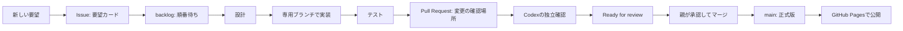

# IBUKI STUDY BEAT 用語集

最終更新: 2026-08-12 / 管理: Codex・Claude

この用語集は、開発中に出てくるカタカナ語・略語・記号を、**ほかの資料を開かなくても一度で分かる**ように説明するためのものです。

各項目は「何か」「このアプリでは何を指すか」「今どうなっているか」をセットで書きます。分からない言葉が新しく出たら、説明するAIがこのファイルに先に追記します。

## まず全体像



例: 「ショップに画像を置きたい」は、いきなりアプリを変えるのではなく、まず [Issue #3](https://github.com/arumat-ken/ibuki-study-beat/issues/3) に記録し、画像案→実装→確認→公開の順で進めます。

## 記号の読み方

| 記号・書き方 | 意味 | 例 |
|---|---|---|
| `#` | GitHubの番号。番号を付けて同じ話題を追える。 | `PR #2` は2番目の変更提案、`Issue #3` は3番目の要望カード。 |
| `ver.4.1.0` | アプリの版番号。大きい順に「大きな世代.機能追加.小さな修正」。 | `4.1.0` は4系統の、1回目の機能追加版。 |
| `✅` / `❌` / `🟡` | 完了 / 不可・未対応 / 進行中または判断待ち。 | `✅ テスト合格`、`🟡 Draft`。 |
| `→` | 次に進む順番。 | `テスト → レビュー → 公開`。 |
| `` `この形` `` | ファイル名・コマンド名・保存キーなど、正確な文字列。意味を変えずに扱う。 | `ibukiStudyBeat.v3`。 |
| `×` | 配色や倍率の組合せ。掛け算の意味とは限らない。 | 「黒×ゴールド」は黒と金色を組み合わせる世界観。 |

## いまの作業カード

| 名前 | 何をするものか | 2026-08-10時点 |
|---|---|---|
| [PR #2](https://github.com/arumat-ken/ibuki-study-beat/pull/2) | ver.4.1.0の「ポイント・装備・ショップ」をアプリへ入れる変更提案。 | 本体の実装と独立検証は完了。画像プロンプト集を外してから、公開確認へ進む。 |
| [Issue #3 / APP-430](https://github.com/arumat-ken/ibuki-study-beat/issues/3) | ショップの文字のそばに、衣装・スキル・ステージの見た目を出す要望。 | 順番待ち。Geminiが画像を作り、Claudeがアプリへ置き、Codexが確認する。 |
| [PR #1 / OPS-001](https://github.com/arumat-ken/ibuki-study-beat/pull/1) | CodexとClaudeが安全に仕事を引き継ぐ仕組み。 | Draft。GitHub上のPR・Issueコメントは使えているが、同じMacの完全自動共有は環境差のため未完了。 |
| APP-420 | 金融ラボ・GT・PayPay交換申請。 | APP-410（PR #2相当）の完了後まで順番待ち。 |

## 仕事の進み方

### Issue（イシュー）

**何か**: 「こんなものが欲しい」「この不具合を直したい」を残す要望カードです。コードはまだ変わりません。

**このアプリでは**: 新しい依頼は、まずIssueかタスク台帳に残します。これにより、忘れたり、別の作業に混ぜたりしません。

**例**: Issue #3は「画像付きショップ」の要望そのものです。

### backlog（バックログ）

**何か**: やることは決まっているが、まだ始めない「順番待ち」の列です。

**このアプリでは**: 先に学習記録の安全性を守る作業を終えるため、画像付きショップはPR #2の公開後に始めます。

### WIP上限1

**何か**: WIPは *Work In Progress* の略で「いま手を動かしている仕事」です。上限1は、一人のAIが同時に一件だけ持つ約束です。

**なぜ必要か**: 二つを同時に変えると、どちらの変更か分からなくなり、修正漏れや待ちぼうけが起きるためです。

### 設計 → 実装 → 検証

**設計**は完成形を決めること、**実装**はアプリのファイルを変えること、**検証**は壊れていないと試して確かめることです。

画像付きショップの例では、Geminiが画像の見た目を作る→Claudeがアプリに表示する→CodexがiPhone画面で確認する、という分担になります。

## GitHubと公開

### Git（ギット）とリポジトリ

**Git**は、ファイルの変更履歴を安全に残す仕組みです。**リポジトリ**は、その履歴とファイルを保管する箱です。

このアプリの正本は GitHub の `arumat-ken/ibuki-study-beat` です。AIの一時チャット内だけに、正式な成果物を置きません。

### main（メイン）

**何か**: 正式に公開してよい変更だけを入れる基準の枝です。

**このアプリでは**: `main` の内容が公開アプリになります。誰も直接書き換えず、必ずPRを確認してから入れます。現在の公開版は `ver.4.0.0` です。

### ブランチ

**何か**: 正式版を壊さずに作業するための、変更履歴の分かれ道です。

**例**: `claude/...` はClaudeの実装用、`codex/...` はCodexの設計・検証資料用です。

### commit（コミット）

**何か**: ある時点の変更に付ける「保存済みのしおり」です。何を変えたか、あとから正確に戻って確認できます。

**例**: `e33709a` はver.4.1.0のリリース表示を追加したコミットです。短い英数字だけで指せるため、同じ変更を取り違えません。

### Pull Request / PR（プルリクエスト）

**何か**: 「このブランチの変更をmainに入れてよいか」を、差分・試験結果・コメントで確認する画面です。略してPRと呼びます。

**重要**: PRを作っただけでは公開されません。PR #2は、ver.4.1.0を提案している確認場所です。

### Draft（ドラフト）

**何か**: 「まだ作業中。公開判断をしないでください」という印です。

**このアプリでは**: テストやレビューが済むまでDraftにします。PR #2は、画像プロンプト集を整理する間もDraftです。

### Ready for review（レビュー準備完了）

**何か**: 「作り手は完了したので、確認・公開判断をお願いします」という印です。

**誤解しやすい点**: これは**公開完了ではありません**。親の承認とマージが次に必要です。

### merge（マージ）

**何か**: PRで確認した変更を、正式版の`main`へ取り込むことです。

**このアプリでは**: 親の明示承認後にだけ行います。直接pushとは違い、確認記録が残ります。

### GitHub Pages（ギットハブ・ページズ）

**何か**: GitHubにある`main`のファイルを、Webアプリとして公開する仕組みです。

**このアプリでは**: マージ後およそ1分で [公開アプリ](https://arumat-ken.github.io/ibuki-study-beat/) が更新されます。

### handoff（引き継ぎ）

**何か**: 担当AIが変わっても、次の人が迷わず続きをできるように、目的・変更・試験結果・次の操作を残すことです。

**このアプリでは**: PR・Issue・`docs/exchange/`が引き継ぎノートです。人が回答文やコードをコピーして運ばなくても、同じGitHub記録を両AIが読みます。

### push / pull / fetch（プッシュ・プル・フェッチ）

**何か**: 手元のコピーとGitHubの間で内容をやり取りする3つの命令です。**push**は手元→GitHub、**pull**はGitHub→手元、**fetch**は「GitHub側の最新を見に行くだけで、手元にはまだ反映しない」動きです。

**このアプリでは**: Claudeの作業はクラウド上の使い捨ての機械で動くため、pushしていない変更はセッション終了とともに消えます。だから「作った」ではなく「pushした」までが完了です。

**例**: 用語集アプリは `claude/app-450-glossary-pwa` へpushした時点でGitHubに残り、[PR #9](https://github.com/arumat-ken/ibuki-study-beat/pull/9) から見られるようになりました。

### 差分 / diff（ディフ）

**何か**: 変更前と変更後の違いだけを取り出したものです。GitHubでは緑が追加、赤が削除で表示されます。

**このアプリでは**: PRの **Files changed** タブが差分です。「何が変わるのか」を確かめる一番確実な場所で、マージ前にここだけ見れば意図しない変更が混ざっていないか分かります。

**誤解しやすい点**: 画像などは中身が文字ではないため、GitHubの行数表示が「0」になります。**0行=変更なし、ではありません**。PR #7で実際にこの読み違いが起きました。ファイル名の一覧（`A`=追加、`D`=削除）で確認します。

### コンフリクト（衝突）

**何か**: 同じ場所を2人が別々に書き換えたため、どちらを採用するか機械が決められない状態です。

**このアプリでは**: ClaudeとCodexが別々のブランチで同じファイルを触ると起きます。起きた場合はPRに警告が出るので、作業した側が直します。親の操作は不要です。

**例**: いまのところ発生していません。用語集はCodexが、アプリ本体はClaudeが主に触ることで避けています。

### 凍結（フリーズ）

**何か**: あるPRやブランチに対して「これ以上コミットを足さない」と決めることです。Gitの機能ではなく、人とAIの間の**約束**です。

**このアプリでは**: 検証が終わった状態を動かさないために使います。凍結中のPRは、中身が「Codexが確認した時点」と1バイトも変わらないことが保証されます。

**例**: [PR #7](https://github.com/arumat-ken/ibuki-study-beat/pull/7)（ショップ画像15点）はCodexにより凍結中です。残り4点の画像も、凍結が解けるまで足していません。

### Watch / 購読（つうち設定）

**何か**: リポジトリやPRに動きがあったとき、知らせを受け取る設定です。

**このアプリでは**: 2種類あります。**親向け**はGitHubの画面右上の **Watch → All Activity** で、IssueもPRもiPhoneに通知が届きます。**Claude向け**は購読ツールで、**PRの動きだけ**が届きます。

**大事な点**: **ClaudeにはIssueの通知が届きません。**Claude宛の指示は必ずPRに書きます。これはClaudeの怠慢ではなく、通知の経路が存在しないという構造上の制約です。

### 課題番号（APP-4xx / OPS-0xx）

**何か**: やることに付ける通し番号です。`APP-`はアプリそのものの改良、`OPS-`はAI同士の進め方の改良を指します。

**このアプリでは**: 番号でIssue・ブランチ・PR・コミットが一本につながります。ブランチ名も `claude/app-450-glossary-pwa` のように番号を含めます。

**例**: APP-430=ショップ画像、APP-440=タイマー放置によるBP水増し対策、APP-450=用語集アプリ、APP-451=用語集の中身、OPS-001=Codexとの引き継ぎ、OPS-002=Gemini画像の受け入れ。

**誤解しやすい点**: **課題番号とPR番号は別物です。**

| | 例 | 誰が付けるか | 何を指すか |
|---|---|---|---|
| 課題番号 | `APP-451` | 私たち | やること |
| PR番号 | `#9` | GitHubが自動 | 変更の申請書 |

1つの課題に対してPRが1つ作られるので、`APP-450` の申請書が `PR #9` という対応になります。番号が一致しないのは正常です。「APP-451とPR #9」のように並べて書くと、同じ種類の番号に見えて混乱するため、**課題番号は `APP-` を付けたまま、PR番号は `PR #` を付けたまま**書きます。

## AIの担当

### 親

アプリの所有者で、何を優先するか、公開してよいかを最終決定する人です。ここではarumat-kenさんを指します。

### Claude Code

アプリ本体を実装し、試験を動かし、専用ブランチとPRを作る担当です。`index.html`、`css/app.css`、`js/*.js`、`sw.js`を変更できるのはClaudeです。

### Codex

仕様の整理、UIレビュー、独立した試験、引き継ぎ記録、用語集を担当します。アプリ本体を勝手に変えず、完成前に「安全か」「iPhoneで読めるか」を別の立場で確認します。

### Gemini

今回のAPP-430では、アイテム画像を作る担当です。Geminiが作るのは画像そのもので、アプリへ置く・表示する・オフラインで使えるようにする作業はClaudeが担当します。

**注意**: Geminiに画像を作ってもらうことと、公開アプリが外部通信することは別です。完成した画像をリポジトリ内へ入れるため、公開アプリは外部から画像を取りに行きません。

## テストと安全

### ChatGPT / GPT / Codex の関係

**何か**: **ChatGPT**はOpenAIの対話AIサービスの名前、**GPT**はその中で動くAIの型式名、**Codex**はChatGPTの中にある開発作業向けの動作モードです。

**このアプリでは**: 親が「ChatGPTの画面」で話している相手が、開発モードのときはCodexです。名前が3つあっても**担当は1人**で、設計・独立確認・仕様の守り役を務めます。

**誤解しやすい点**: 「ChatGPTに頼んだ」と「Codexに頼んだ」は同じ相手を指すことがあります。逆に、GeminiとClaudeは別のAIで、互いの会話は見えません。

### CI（シー・アイ／自動チェック）

**何か**: GitHubがPRを受け取るたびに、決められた検査を自動で流す仕組みです。人が押さなくても走ります。

**このアプリでは**: **まだ入れていません**。試験はClaudeが手元で流し、結果をPRに書いて報告しています。PRの画面に緑や赤のチェック印が出ないのはこのためで、異常ではありません。

**今後**: 用語集の書き漏らし検出などを自動化する候補です。入れるかどうかはCodexと相談して決めます。

### セッション

**何か**: 親とAIの1回分の会話のまとまりです。

**このアプリでは**: Claudeはクラウド上の**使い捨ての機械**で動き、セッションが終わると機械ごと片付けられます。手元に作っただけのファイルは消えます。だからpushするまでが作業です。

**大事な点**: 会話が長くなると、前半は要約に置き換わります。決めたことを覚えておく場所は会話ではなく、**GitHub上の文書**です。

### プロトコル（手順の取り決め）

**何か**: 誰が・どの順番で・何を書くかを決めた約束事です。

**このアプリでは**: `docs/exchange/PROTOCOL.md` に、ClaudeとCodexの受け渡し手順を書いてあります。守れているかを確かめられるように、口約束ではなく文書にしています。

### 安全フィルタ

**何か**: AIが「作ってはいけない」と判断して生成を断る仕組みです。

**このアプリでは**: 画像生成で問題になりました。実在の人物を連想させる語（ダンス技名や帽子の型名）を含むと、Geminiが生成を拒みます。そのためプロンプトからそれらの語を外してあります。

**大事な点**: Draw Thingsのように手元で動く道具にはフィルタがありません。断られたときは、道具を替えるか語を言い換えます。

### 単体テスト

**何か**: 計算など、小さな部品が正しい答えを出すかを自動で確かめる試験です。

**例**: 「1分の学習は1BP」「一日の上限は1,500BP」「同じ日にボーナスを二重に付けない」といった計算を確認します。PR #2は59件合格です。

### 受入試験 / E2E（エンドツーエンド）

**何か**: 実際の利用者のように、画面を開く→ボタンを押す→保存する、という一連の操作を試す自動試験です。

**例**: iPhone幅320pxでショップを開いても横に切れない、集中モードではショップが使えない、という確認です。PR #2は158件合格です。

### 独立検証

**何か**: 作った本人とは別の担当が、同じ試験や実画面確認をやり直すことです。

**なぜ必要か**: 「自分の環境でだけ動く」問題や、見落としを減らせるためです。PR #2はCodexが独立して確認済みです。

### ブロッカー

**何か**: 「これが直らない限り、先(マージや公開)へ進めてはいけない」というレベルの指摘です。英語の "blocker"(妨げるもの)から来ています。

**このアプリでは**: レビューの結果を「ブロッカーあり」「ブロッカーなし」で分けます。ブロッカーが無ければ、直さなくても先(次のレビューやマージ)へ進んでよい、という意味です。ブロッカーでない指摘(軽微な改善提案など)は、直しても直さなくてもマージを妨げません。

**具体例**: PR #16(APP-481)でAntigravityは「`contentLabel`の戻り値がHTML文字列である旨をコメントに書いておくと安全」と指摘しましたが、まとめで「**ブロッカーとなる指摘はありません**」と明記しました。つまりこの指摘は直さなくてもマージしてよい軽微な提案で、実際にはClaudeが直してから報告しましたが、必須ではありませんでした。

**誤解しやすい点**: 「指摘があった」=「ブロッカー」ではありません。レビューする側は指摘のたびに「これはブロッカーか、軽微な提案か」を分けて伝える必要があります。分けずに指摘だけ並べると、直すべきかどうか読み手が判断できなくなります。**P1**(優先度が高い不具合の印)と似ていますが、P1は見つかった不具合そのものの重さを表し、ブロッカーはレビュー結果として「先へ進めてよいか」を表す点が異なります。

### `git diff --check`

**何か**: ファイル末尾の余計な空白など、見えにくい書式の壊れを探す確認です。

**意味**: 合格しても機能が正しいとまでは言いませんが、不要な書式事故を防ぐ基本確認です。

### P1

**何か**: 優先度が高く、公開前に直す必要がある問題の印です。

**例**: 同じ日のBPが二重に増える、受験30日前なのにショップが使える、といった問題はP1として修正しました。

### 回帰確認 / リグレッション

**何か**: 新しく足した変更が、**今まで動いていた所を壊していないか**を確かめることです。「後戻り」を意味する言葉です。

**このアプリでは**: 変更のたびに既存の試験を全部流し直し、件数が前回と同じ「全合格」であることを確認します。新機能が動くことより、既存機能が壊れていないことのほうを重く見ます。

**例**: 用語集アプリ（PR #9）では、新しい試験31件に加えて既存の受入試験158件・単体テスト59件を流し、変更前と同じく全合格であることを確かめました。試験の中に「アプリ本体が今までどおり開くか」という項目も入れてあります。

### Playwright（プレイライト）

**何か**: 人の代わりにブラウザを操作して、画面が正しく出るか確かめる道具です。

**このアプリでは**: 受入試験（E2E）の実行に使います。iPhoneと同じ画面幅で開き、ボタンを押し、表示を読み取り、スクリーンショットを保存します。文字が重なる・画面が横にはみ出すといった不具合も、ここで見つけます。

**例**: 受験科目の切り替えボタンが320pxの画面で潰れていた不具合は、Playwrightの画面写真で発見しました。

## 画像とデザイン

### プロンプト

**何か**: 画像生成AIに「こういう絵を描いて」と伝える指示文のことです。

**このアプリでは**: ショップのアイテム19点の絵柄を、`docs/design/item_image_prompts.json` に1件ずつ定義してあります。誰がどの道具で作っても同じ世界観（黒×ゴールド）になるようにするためです。

**大事な点**: 道具によって**書き方が違います**。Geminiは英語の説明文、Draw Things（Stable Diffusion系）はカンマ区切りの単語の羅列です。同じプロンプトを使い回すと結果が崩れます。

### ネガティブプロンプト

**何か**: 「これは描かないで」と伝える指示です。プロンプトとは**別の入力欄**に書きます。

**このアプリでは**: 人物・顔・手・文字・透かしを除外するために使います。アイテムの絵に人が写り込まないようにするためです。

**誤解しやすい点**: Geminiには専用欄がないので本文に `NEGATIVE:` と書きますが、Draw Thingsには専用欄があります。本文に書いても効きません。

### 画像生成AI（Gemini / Draw Things / Stable Diffusion）

**何か**: 文章から絵を作るAIです。**Gemini**はGoogleのもので、チャットで頼みます。**Draw Things**はMacやiPhoneで動くアプリで、**Stable Diffusion**という仕組みを手元で動かします。

**このアプリでは**: Geminiは安全フィルタで弾かれることがあり、実在の人物を連想させる語を避けたプロンプトを用意しています。Draw Thingsは手元で動くのでフィルタがありません。

**大事な点**: **どのAIもGitHubへ直接保存できません。**画像は必ず親がダウンロードしてアップロードするか、チャットへ添付します。「保存しました」という返事があっても、実際には保存されていません。

### 透かし（ウォーターマーク）

**何か**: AIが作った画像の隅に入る、生成元を示す小さな印です。

**このアプリでは**: Geminiの画像は右下に透かしが入るため、Claudeが位置を実測したうえで切り取り、512×512に整えてから登録しています。親の作業は不要です。

## アプリ固有の言葉

### PWA（ピー・ダブリュー・エー）

**何か**: Webサイトを、iPhoneのホーム画面からアプリのように開ける形にしたものです。

**このアプリでは**: iPhone Safari向けのPWAです。App Store経由ではなく、ブラウザからホーム画面に追加して使います。

### localStorage（ローカルストレージ）

**何か**: 学習記録を、インターネット上ではなく使っているiPhoneの中に保存する場所です。

**このアプリでは**: 保存名は `ibukiStudyBeat.v3` です。この名前を変えると、過去の学習記録を見つけられなくなるため変えません。

### 外部通信ゼロ

**何か**: 公開アプリが、学習記録や画像を外部サーバーへ送ったり、外部サイトから読み込んだりしない性質です。

**このアプリでは**: 記録と画像は端末またはリポジトリ内で扱います。AIへ相談する時だけ、利用者が選んだAIアプリへ質問文を渡す操作がありますが、アプリが記録を自動送信する仕組みではありません。

### Service Worker（サービスワーカー）とキャッシュ

**何か**: 一度開いたアプリのファイルを端末に覚え、通信が不安定でも開きやすくする仕組みです。覚えたコピーを**キャッシュ**と呼びます。

**このアプリでは**: 新しい画像を追加する時は、Claudeが `sw.js` にも画像を登録し、オフラインでも表示できるようにします。

### BP（ビーピー）

**何か**: 学習や行動で得るアプリ内ポイントです。お金ではありません。

**例**: 基本は学習1分につき1BPで、装備やコンディションで倍率が変わります。BPはショップで衣装・スキル・ステージ・消費アイテムを得るために使います。

### GT（ジーティー）

**何か**: ver.4.2.0で扱う予定の、金融ラボ内の別の単位です。

**今の状態**: 計算ロジックはありますが、公開アプリ画面にはまだ入りません。PR #2の後に検討します。

### 装備・衣装・スキル・ステージ

**装備**はコーチに設定する3つの枠の総称です。**衣装**は常に効く見た目の道具、**スキル**は条件を満たすと効く能力、**ステージ**は進行度を表す舞台です。

**APP-430での変化**: いまは文字だけですが、Geminiが作る「物・光・会場」の画像を文字のそばに表示し、購入前に見た目が分かるようにします。

### コンディション

**何か**: 睡眠など生活習慣5項目の記録から作る、翌日の学習倍率への小さなボーナスです。

**大事な点**: 受験30日前の集中モードでも、コンディションは学習習慣そのものなので残します。ショップの装備・消費アイテムとは別です。

### 集中モード

**何か**: 受験日の30日前から、ショップなどのゲーム要素を自動で止め、学習記録とカウントダウンを主役に戻す安全装置です。

**残るもの**: 学習記録、コーチ、AIへの相談。**止まるもの**: 装備、ショップ、消費アイテムによる倍率です。

### scope（スコープ）

**何か**: 「その仕組みが効く範囲」のことです。

**このアプリでは**: Service Workerに範囲があります。アプリ本体のものはサイト全体を、用語集のものは `glossary/` の中だけを担当します。範囲が狭いほうが優先されるので、2つ置いても衝突しません。

**別の使い方**: 話の中では「今回やる範囲」の意味でも使います。「スコープ外」は「今回はやらない」という意味です。

### スワイプアップ / App Switcher / バックグラウンド / 終了

**何か**: iPhoneでアプリを切り替えたり閉じたりする操作と、そのときのアプリの状態です。

| 言葉 | 何を指すか |
|---|---|
| **スワイプアップ** | 画面の下端から指を上へ滑らせる操作。ホームに戻る、またはApp Switcherを出す |
| **App Switcher** | 起動中のアプリが横並びになる画面。下端から上へ滑らせて途中で止めると出る |
| **バックグラウンド** | App Switcherに残っている状態。**終了していない**。すぐ戻れる |
| **終了(強制終了)** | App Switcherでアプリのカードを上へ送り出して消すこと。**アプリは止まる** |

**誤解しやすい点**: 「フリック」は本来、**画面の中で指をはじく短い操作**を指します。アプリを閉じる操作は「App Switcherでスワイプして終了する」が正確な言い方です。

**このアプリでは**: **どちらの状態になってもタイマーは止まりません。**開始した時刻を端末に保存し、表示のたびに「いまの時刻 − 開始時刻」を計算し直しているためです。実測で、バックグラウンドから戻した場合も、終了させて開き直した場合も、経過時間が正しく残ることを確認しています。

**大事な点**: 秒を数え続ける仕組みではないので、iOSにアプリを止められても影響を受けません。逆に言えば、**アプリが動いていなくても時間は進みます**。

### ホーム画面に追加

**何か**: WebページをiPhoneのホーム画面にアイコンとして置き、アプリのように開けるようにする操作です。Safariの共有ボタンから行います。

**このアプリでは**: App Storeを通さずに配れる方法です。学習アプリ本体と用語集アプリは、それぞれ別のアイコンとして置けます。

**大事な点**: **Chromeではできません。**必ずSafariで開いてから追加します。

## 新しい言葉を追加するルール

新しい専門用語・略語・記号・機能名が出たら、最初に使うAIはこの用語集へ次の4点を追記します。

1. **やさしい一文**: 小学生高学年にも通じる言い方で「何か」を説明する。
2. **このアプリでの意味**: 一般的な意味だけで終わらせず、どの画面・作業に関わるかを書く。
3. **具体例**: 現在のPR・Issue・画面・操作のどれか一つを挙げる。
4. **誤解しやすい点**: 似た言葉との違い、公開済みかどうか、データに影響するかを明記する。

同じ意味の言葉が複数ある時は、一番分かりやすい日本語を見出しにし、別名も同じ項目に書きます。説明を「別の用語を読まないと分からない」形にしません。

### マニフェスト

**一覧表**のことです。何がどれだけ入っているかを、あとから確認できる形で書き残した表を指します。

**このアプリでの意味**: `assets/items/MANIFEST.md` が該当します。ショップのアイテム画像15点について、アイテムID・種別・名称・ファイル名・寸法・容量・SHA-256(ファイルの指紋)・代替説明文・出所・利用許諾を並べた表です。

**具体例**: 「白いソックスの絵は本当に `socks.png` なのか」「差し替えられていないか」を確認したいとき、この表を見ます。SHA-256が一致すれば同じファイル、違えば中身が変わっています。

**誤解しやすい点**: 表に「未記録」と書いてある欄は、**調べていない**のではなく**ファイルからは判別できない**という意味です。たとえば「どの画像をDraw Thingsで作り、どれをGeminiで作ったか」は画像そのものからは分かりません。**推測で埋めず、分からないことは分からないと書く**方針にしています。

なお、PWAの `manifest.webmanifest`(ホーム画面に追加するときの設定ファイル)も同じ英単語ですが、別のものです。

### いつ書くか

**説明した直後**です。「あとでまとめて」は必ず漏れます。実際、このルールは最初から書かれていたにもかかわらず、2026-08-10の1日だけで14語（push、差分、凍結、プロンプト、回帰確認など）が抜けました。親の作業が止まる原因は、ほぼこの取りこぼしです。

### 書き漏らしの検出

守り忘れても気づけるように、検出スクリプトを置いてあります。

```
node tools/glossary_check.mjs docs/ README.md
```

指定したファイルに出てくるカタカナ語・略語・記号のうち、**この用語集に説明が無いもの**を一覧にします。よくある一般語（アプリ、ファイル、テストなど）は `tools/glossary_ignore.json` で除外しています。

検出できるのは「無いこと」だけで、**説明そのものは書けません**。文章を書くのはClaudeかCodexの仕事です。スクリプトの役割は、忘れたことを見えるようにするところまでです。

### 何を書かないか

すべてのカタカナ語を登録すると、かえって引きにくくなります。次は登録しません。

- 一般的な日本語として通じる語（アプリ、ファイル、ボタン、メニュー）
- 一度きりで再登場しない語
- コードの中だけに出てきて、会話には出ない変数名
