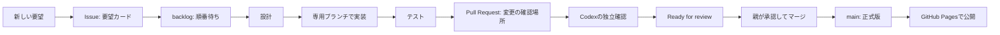

# IBUKI STUDY BEAT 用語集

最終更新: 2026-08-10 / 管理: Codex・Claude

この用語集は、開発中に出てくるカタカナ語・略語・記号を、**ほかの資料を開かなくても一度で分かる**ように説明するためのものです。

各項目は「何か」「このアプリでは何を指すか」「今どうなっているか」をセットで書きます。分からない言葉が新しく出たら、説明するAIがこのファイルに先に追記します。

## まず全体像

例: 「ショップに画像を置きたい」は、いきなりアプリを変えるのではなく、まず [Issue #3](https://github.com/arumat-ken/ibuki-study-beat/issues/3) に記録し、画像案→実装→確認→公開の順で進めます。

## 記号の読み方

| 記号・書き方 | 意味 | 例 |
|---|---|---|
| `#` | GitHubの番号。番号を付けて同じ話題を追える。 | `PR #2` は2番目の変更提案、`Issue #3` は3番目の要望カード。 |
| `ver.4.1.0` | アプリの版番号。大きい順に「大きな世代.機能追加.小さな修正」。 | `4.1.0` は4系統の、1回目の機能追加版。 |
| `✅` / `❌` / `🟡` | 完了 / 不可・未対応 / 進行中または判断待ち。 | `✅ テスト合格`、`🟡 Draft`。 |
| `→` | 次に進む順番。 | `テスト → レビュー → 公開`。 |
| `` `この形` `` | ファイル名・コマンド名・保存キーなど、正確な文字列。意味を変えずに扱う。 | `ibukiStudyBeat.v3`。 |
| `×` | 配色や倍率の組合せ。掛け算の意味とは限らない。 | 「黒×ゴールド」は黒と金色を組み合わせる世界観。 |

## いまの作業カード

| 名前 | 何をするものか | 2026-08-10時点 |
|---|---|---|
| [PR #2](https://github.com/arumat-ken/ibuki-study-beat/pull/2) | ver.4.1.0の「ポイント・装備・ショップ」をアプリへ入れる変更提案。 | 本体の実装と独立検証は完了。画像プロンプト集を外してから、公開確認へ進む。 |
| [Issue #3 / APP-430](https://github.com/arumat-ken/ibuki-study-beat/issues/3) | ショップの文字のそばに、衣装・スキル・ステージの見た目を出す要望。 | 順番待ち。Geminiが画像を作り、Claudeがアプリへ置き、Codexが確認する。 |
| [PR #1 / OPS-001](https://github.com/arumat-ken/ibuki-study-beat/pull/1) | CodexとClaudeが安全に仕事を引き継ぐ仕組み。 | Draft。GitHub上のPR・Issueコメントは使えているが、同じMacの完全自動共有は環境差のため未完了。 |
| APP-420 | 金融ラボ・GT・PayPay交換申請。 | APP-410（PR #2相当）の完了後まで順番待ち。 |

## 仕事の進み方

### Issue（イシュー）

**何か**: 「こんなものが欲しい」「この不具合を直したい」を残す要望カードです。コードはまだ変わりません。

**このアプリでは**: 新しい依頼は、まずIssueかタスク台帳に残します。これにより、忘れたり、別の作業に混ぜたりしません。

**例**: Issue #3は「画像付きショップ」の要望そのものです。

### backlog（バックログ）

**何か**: やることは決まっているが、まだ始めない「順番待ち」の列です。

**このアプリでは**: 先に学習記録の安全性を守る作業を終えるため、画像付きショップはPR #2の公開後に始めます。

### WIP上限1

**何か**: WIPは *Work In Progress* の略で「いま手を動かしている仕事」です。上限1は、一人のAIが同時に一件だけ持つ約束です。

**なぜ必要か**: 二つを同時に変えると、どちらの変更か分からなくなり、修正漏れや待ちぼうけが起きるためです。

### 設計 → 実装 → 検証

**設計**は完成形を決めること、**実装**はアプリのファイルを変えること、**検証**は壊れていないと試して確かめることです。

画像付きショップの例では、Geminiが画像の見た目を作る→Claudeがアプリに表示する→CodexがiPhone画面で確認する、という分担になります。

## GitHubと公開

### Git（ギット）とリポジトリ

**Git**は、ファイルの変更履歴を安全に残す仕組みです。**リポジトリ**は、その履歴とファイルを保管する箱です。

このアプリの正本は GitHub の `arumat-ken/ibuki-study-beat` です。AIの一時チャット内だけに、正式な成果物を置きません。

### main（メイン）

**何か**: 正式に公開してよい変更だけを入れる基準の枝です。

**このアプリでは**: `main` の内容が公開アプリになります。誰も直接書き換えず、必ずPRを確認してから入れます。現在の公開版は `ver.4.0.0` です。

### ブランチ

**何か**: 正式版を壊さずに作業するための、変更履歴の分かれ道です。

**例**: `claude/...` はClaudeの実装用、`codex/...` はCodexの設計・検証資料用です。

### commit（コミット）

**何か**: ある時点の変更に付ける「保存済みのしおり」です。何を変えたか、あとから正確に戻って確認できます。

**例**: `e33709a` はver.4.1.0のリリース表示を追加したコミットです。短い英数字だけで指せるため、同じ変更を取り違えません。

### Pull Request / PR（プルリクエスト）

**何か**: 「このブランチの変更をmainに入れてよいか」を、差分・試験結果・コメントで確認する画面です。略してPRと呼びます。

**重要**: PRを作っただけでは公開されません。PR #2は、ver.4.1.0を提案している確認場所です。

### Draft（ドラフト）

**何か**: 「まだ作業中。公開判断をしないでください」という印です。

**このアプリでは**: テストやレビューが済むまでDraftにします。PR #2は、画像プロンプト集を整理する間もDraftです。

### Ready for review（レビュー準備完了）

**何か**: 「作り手は完了したので、確認・公開判断をお願いします」という印です。

**誤解しやすい点**: これは**公開完了ではありません**。親の承認とマージが次に必要です。

### merge（マージ）

**何か**: PRで確認した変更を、正式版の`main`へ取り込むことです。

**このアプリでは**: 親の明示承認後にだけ行います。直接pushとは違い、確認記録が残ります。

### GitHub Pages（ギットハブ・ページズ）

**何か**: GitHubにある`main`のファイルを、Webアプリとして公開する仕組みです。

**このアプリでは**: マージ後およそ1分で [公開アプリ](https://arumat-ken.github.io/ibuki-study-beat/) が更新されます。

### handoff（引き継ぎ）

**何か**: 担当AIが変わっても、次の人が迷わず続きをできるように、目的・変更・試験結果・次の操作を残すことです。

**このアプリでは**: PR・Issue・`docs/exchange/`が引き継ぎノートです。人が回答文やコードをコピーして運ばなくても、同じGitHub記録を両AIが読みます。

## AIの担当

### 親

アプリの所有者で、何を優先するか、公開してよいかを最終決定する人です。ここではarumat-kenさんを指します。

### Claude Code

アプリ本体を実装し、試験を動かし、専用ブランチとPRを作る担当です。`index.html`、`css/app.css`、`js/*.js`、`sw.js`を変更できるのはClaudeです。

### Codex

仕様の整理、UIレビュー、独立した試験、引き継ぎ記録、用語集を担当します。アプリ本体を勝手に変えず、完成前に「安全か」「iPhoneで読めるか」を別の立場で確認します。

### Gemini

今回のAPP-430では、アイテム画像を作る担当です。Geminiが作るのは画像そのもので、アプリへ置く・表示する・オフラインで使えるようにする作業はClaudeが担当します。

**注意**: Geminiに画像を作ってもらうことと、公開アプリが外部通信することは別です。完成した画像をリポジトリ内へ入れるため、公開アプリは外部から画像を取りに行きません。

## テストと安全

### 単体テスト

**何か**: 計算など、小さな部品が正しい答えを出すかを自動で確かめる試験です。

**例**: 「1分の学習は1BP」「一日の上限は1,500BP」「同じ日にボーナスを二重に付けない」といった計算を確認します。PR #2は59件合格です。

### 受入試験 / E2E（エンドツーエンド）

**何か**: 実際の利用者のように、画面を開く→ボタンを押す→保存する、という一連の操作を試す自動試験です。

**例**: iPhone幅320pxでショップを開いても横に切れない、集中モードではショップが使えない、という確認です。PR #2は158件合格です。

### 独立検証

**何か**: 作った本人とは別の担当が、同じ試験や実画面確認をやり直すことです。

**なぜ必要か**: 「自分の環境でだけ動く」問題や、見落としを減らせるためです。PR #2はCodexが独立して確認済みです。

### `git diff --check`

**何か**: ファイル末尾の余計な空白など、見えにくい書式の壊れを探す確認です。

**意味**: 合格しても機能が正しいとまでは言いませんが、不要な書式事故を防ぐ基本確認です。

### P1

**何か**: 優先度が高く、公開前に直す必要がある問題の印です。

**例**: 同じ日のBPが二重に増える、受験30日前なのにショップが使える、といった問題はP1として修正しました。

## アプリ固有の言葉

### PWA（ピー・ダブリュー・エー）

**何か**: Webサイトを、iPhoneのホーム画面からアプリのように開ける形にしたものです。

**このアプリでは**: iPhone Safari向けのPWAです。App Store経由ではなく、ブラウザからホーム画面に追加して使います。

### localStorage（ローカルストレージ）

**何か**: 学習記録を、インターネット上ではなく使っているiPhoneの中に保存する場所です。

**このアプリでは**: 保存名は `ibukiStudyBeat.v3` です。この名前を変えると、過去の学習記録を見つけられなくなるため変えません。

### 外部通信ゼロ

**何か**: 公開アプリが、学習記録や画像を外部サーバーへ送ったり、外部サイトから読み込んだりしない性質です。

**このアプリでは**: 記録と画像は端末またはリポジトリ内で扱います。AIへ相談する時だけ、利用者が選んだAIアプリへ質問文を渡す操作がありますが、アプリが記録を自動送信する仕組みではありません。

### Service Worker（サービスワーカー）とキャッシュ

**何か**: 一度開いたアプリのファイルを端末に覚え、通信が不安定でも開きやすくする仕組みです。覚えたコピーを**キャッシュ**と呼びます。

**このアプリでは**: 新しい画像を追加する時は、Claudeが `sw.js` にも画像を登録し、オフラインでも表示できるようにします。

### BP（ビーピー）

**何か**: 学習や行動で得るアプリ内ポイントです。お金ではありません。

**例**: 基本は学習1分につき1BPで、装備やコンディションで倍率が変わります。BPはショップで衣装・スキル・ステージ・消費アイテムを得るために使います。

### GT（ジーティー）

**何か**: ver.4.2.0で扱う予定の、金融ラボ内の別の単位です。

**今の状態**: 計算ロジックはありますが、公開アプリ画面にはまだ入りません。PR #2の後に検討します。

### 装備・衣装・スキル・ステージ

**装備**はコーチに設定する3つの枠の総称です。**衣装**は常に効く見た目の道具、**スキル**は条件を満たすと効く能力、**ステージ**は進行度を表す舞台です。

**APP-430での変化**: いまは文字だけですが、Geminiが作る「物・光・会場」の画像を文字のそばに表示し、購入前に見た目が分かるようにします。

### コンディション

**何か**: 睡眠など生活習慣5項目の記録から作る、翌日の学習倍率への小さなボーナスです。

**大事な点**: 受験30日前の集中モードでも、コンディションは学習習慣そのものなので残します。ショップの装備・消費アイテムとは別です。

### 集中モード

**何か**: 受験日の30日前から、ショップなどのゲーム要素を自動で止め、学習記録とカウントダウンを主役に戻す安全装置です。

**残るもの**: 学習記録、コーチ、AIへの相談。**止まるもの**: 装備、ショップ、消費アイテムによる倍率です。

## 新しい言葉を追加するルール

新しい専門用語・略語・記号・機能名が出たら、最初に使うAIはこの用語集へ次の4点を追記します。

1. **やさしい一文**: 小学生高学年にも通じる言い方で「何か」を説明する。
2. **このアプリでの意味**: 一般的な意味だけで終わらせず、どの画面・作業に関わるかを書く。
3. **具体例**: 現在のPR・Issue・画面・操作のどれか一つを挙げる。
4. **誤解しやすい点**: 似た言葉との違い、公開済みかどうか、データに影響するかを明記する。

同じ意味の言葉が複数ある時は、一番分かりやすい日本語を見出しにし、別名も同じ項目に書きます。説明を「別の用語を読まないと分からない」形にしません。
