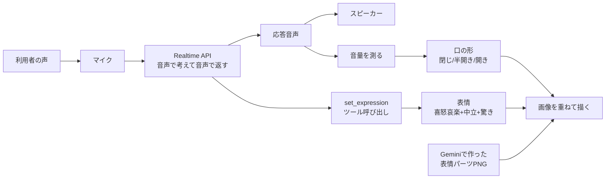
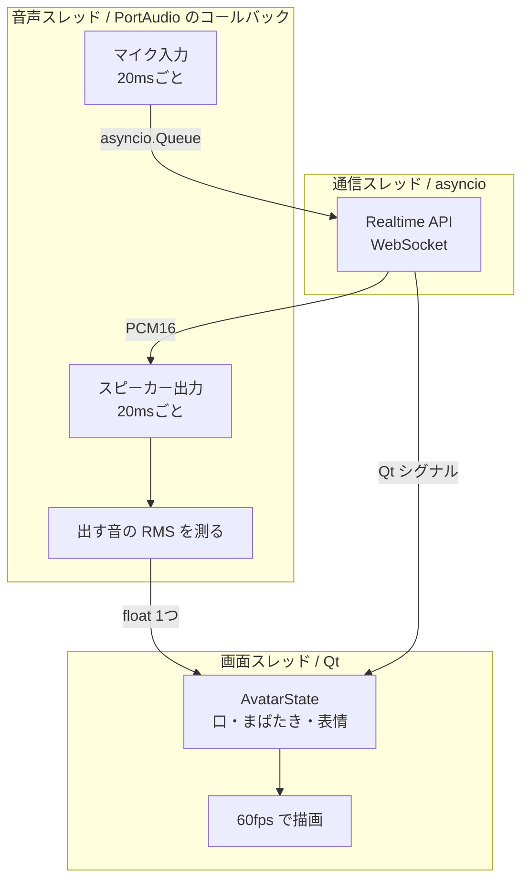
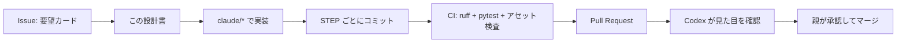

# AI会話アニメーションツール「AVATAR TALK」— 設計と実装手順

作成: 2026-09-05 / 担当: Claude / 状態: 設計確定・未実装

音声でリアルタイムに会話し、**その声に合わせて口が動き、感情に合わせて表情が変わる**
キャラクターを Python で作るための設計書 兼 実装手順書。

この文書は `docs/design/` に置く方針(`tools/glossary_ignore.json` の `excludePaths` 対象)に
従い、**新しい用語は本文の中でその場で定義する**。用語集を開かなくても読めるようにしてある。

---

## 0. 位置づけとスコープ

### 0.1 本体アプリとの境界

**このツールは IBUKI STUDY BEAT 本体(`index.html` / `js/` / `css/` / `sw.js`)を一切変更しない。**
`docs/exchange/PROTOCOL.md` の「守るべき境界」1 と、本体の凍結仕様「外部通信ゼロ」を守るため、
独立したサブプロジェクト `avatar_talk/` として作る。

| | 本体アプリ | このツール |
|---|---|---|
| 動く場所 | iPhone の Safari(PWA) | Mac / Windows のデスクトップ |
| 言語 | 素の HTML/CSS/JS | Python 3.11+ |
| 外部通信 | **ゼロ**(凍結仕様) | OpenAI Realtime API へ常時接続 |
| 保存先 | localStorage | ファイル(会話ログは既定で保存しない) |
| 学習記録 | 触る | **触らない** |

将来 本体と繋ぐとしても、それは別の設計判断として改めて起票する。
今回のスコープには **含めない**。

### 0.2 作るもの



### 0.3 用語(この文書で使うもの)

| 語 | 意味 |
|---|---|
| **Realtime API** | OpenAI の、音声を送ると音声で返ってくる API。文字に起こさず声のまま考えるので返事が速い。ChatGPT アプリの「音声モード」の中身にあたるもので、**API としての正式名称は Live API ではなく Realtime API**。 |
| **PCM16** | 音を数値の列でそのまま表した形式。1サンプル = 2バイトの整数。圧縮していないので、そのまま音量を計算できる。 |
| **RMS(実効値)** | 音の波を二乗して平均して平方根を取った値。**その瞬間どれくらい大きな音か**を1つの数字で表す。口の開き具合はこれで決める。 |
| **dBFS** | 音量の単位。0 が最大で、小さくなるほどマイナスに深くなる。人の耳の感じ方に近いので、口パクの計算はこの単位で行う。 |
| **バージイン** | 相手が話している途中に、こちらが割り込んで話し始めること。割り込まれた側は即座に黙る必要がある。 |
| **レイヤー** | 重ね合わせる画像の1枚1枚。体の上に口を重ねる、という描き方をする。 |
| **マニフェスト** | 一覧表。どの表情がどのファイルを使うかを書いた `manifest.json` を指す。`assets/items/MANIFEST.md` と同じ考え方。 |

---

## 1. 技術選定

| 役割 | 採用 | 理由 | 見送った案 |
|---|---|---|---|
| 会話 | OpenAI **Realtime API**(WebSocket) | 音声→音声で往復するため返事が速い。文字起こし→LLM→音声合成の3段構えだと合計2秒前後かかり、会話にならない | 3段構え(遅い)、WebRTC(ブラウザ向け。Python からは扱いが重い) |
| 通信 | `websockets` を直接 | 送受信の JSON が目に見える。API の仕様変更に気づける | 公式 SDK の `client.realtime.connect()`(短く書けるが、中で何が起きているか見えにくい) |
| 音声入出力 | `sounddevice`(PortAudio) | コールバック方式なので、**再生する瞬間に音量を測れる**。これが口パクの精度を決める | `pyaudio`(保守が滞りがち)、`pygame.mixer`(再生中の音量を取り出せない) |
| GUI | **PySide6**(Qt) | 画像の重ね描き・高解像度画面・60fps のタイマーが標準で揃う。Qt のシグナルが**スレッドをまたぐ通知の安全な通路**になる | `tkinter`(透過 PNG の重ね描きが苦しい)、`pygame`(GUI 部品が無い) |
| 画像生成 | **Gemini**(Nano Banana 系) | 参照画像を渡して「同じ人物のまま表情だけ変える」ができる | 都度テキストから生成(同じキャラクターにならない) |
| 数値計算 | `numpy` | PCM16 の RMS 計算。純 Python だと 20ms ごとの処理に間に合わない | — |

### 1.1 「ChatGPT Live API」という名前について

依頼文にある「ChatGPT Live API」は、**OpenAI の Realtime API** を指しているものとして設計した。
OpenAI で音声のまま会話できる API はこれで、`Live API` という名前の製品は OpenAI には無い
(同名のものは Google Gemini 側にある。**別会社の別 API なので取り違えないこと**)。
モデル名は `gpt-realtime` 系(執筆時点で `gpt-realtime` / `gpt-realtime-2` / `gpt-realtime-2.1` などがある)。

**モデル名とセッション設定の項目名は、版が上がると変わりうる。**
そのため接続に関する設定は `config.py` の1か所だけに集めてある(3.1 節)。
STEP 4 で最初に繋いだとき、`error` イベントが返らないことを必ず目視で確かめる。

---

## 2. 全体構成

### 2.1 3つのスレッドと、その間の約束

音声・通信・描画はそれぞれ止まってはいけないので、別々のスレッドで動かす。
**問題はスレッドをまたぐデータの受け渡し**で、ここを間違えると「たまに固まる」「たまに落ちる」
という再現しにくい不具合になる。そこで、**行き来を片方向に限定する**。



| 境界 | 渡すもの | 仕組み | なぜそれで安全か |
|---|---|---|---|
| 音声 → 通信 | マイクの 20ms 断片 | `loop.call_soon_threadsafe` 経由で `asyncio.Queue` | コールバックは別スレッド。キューに直接入れるとイベントループが壊れる |
| 通信 → 音声 | 応答音声の断片 | ロック付きの `deque` | 積むのと取り出すのが別スレッドなので、ここだけロックする |
| 音声 → 画面 | 音量(float 1つ) | ただの代入 | **共有するのは float 1つと bool 1つだけ**。CPython の単純代入は途中で割り込まれないので、ロックが要らない |
| 通信 → 画面 | 表情・字幕・状態 | **Qt シグナル** | 別スレッドから `emit` すると Qt が自動でキューに積み、画面スレッドで実行される。ウィジェットを直接触らない |

**口とまばたきの計算は、すべて画面スレッドの `tick()` の中だけで行う。**
音声スレッドは「今の音量」を置いていくだけ。この分け方にすると、ロックが1つも要らない。

### 2.2 音量を測る場所 —— ここが一番の勘所

口パクの品質は、**RMS をどこで測るか**でほぼ決まる。

| 測る場所 | 何が起きるか |
|---|---|
| ❌ 受信した瞬間(`response.output_audio.delta` が届いた時) | Realtime API は音声を**まとめて先に**送ってくる。数百ミリ秒〜数秒ぶんが一気に届くこともある。受信時に測ると、**口だけが声より先に動く**(声が出ていないのにパクパクする) |
| ✅ スピーカーへ渡す瞬間(出力コールバックの中) | いま鳴っているバイト列そのものから測るので、**耳に聞こえる音と口が必ず一致する** |

`Player._callback()` の中で、デバイスへ書き込む `block` の RMS をそのまま使う(付録 A-5)。
バッファに何ミリ秒ぶん溜まっていようと、ずれない。

---

## 3. 思考プロセス —— Realtime API 連携

### 3.1 接続とセッション設定

```
wss://api.openai.com/v1/realtime?model=gpt-realtime
Authorization: Bearer <OPENAI_API_KEY>
```

繋いだ直後に `session.update` を1回送り、以後の振る舞いを決める。
**API の版が上がって項目名が変わるなら、まずここ。** そのため設定は `config.py` の
`session_payload()` という辞書1つに閉じ込め、他のファイルには一切書かない。

| 設定 | 値 | 理由 |
|---|---|---|
| 音声の形式 | PCM16 / 24000Hz / モノラル | 圧縮されていないので RMS がそのまま計算できる。口パクのために必須 |
| 発話の区切り | `semantic_vad` | 「間」ではなく**話が終わったか**で判断する。考えながら話す高校生の沈黙で切られない |
| 割り込み | `interrupt_response: true` | 相手が話し始めたらモデル側も応答を止める |
| 出力 | `["audio"]` | 音声のみ。字幕は `response.output_audio_transcript.delta` から別途もらう |
| ツール | `set_expression` 1つ | 表情の切り替え(3.3 節) |

### 3.2 やりとりするイベント

| 向き | イベント | 用途 |
|---|---|---|
| 送 | `session.update` | 上記の設定。接続直後に1回 |
| 送 | `input_audio_buffer.append` | マイクの 20ms 断片を base64 にして送り続ける。**区切りは `semantic_vad` に任せるので `commit` は送らない** |
| 送 | `conversation.item.create`(`function_call_output`) | ツール呼び出しへの返事 |
| 受 | `response.output_audio.delta` | 応答音声。base64 を戻して再生キューへ |
| 受 | `response.output_audio_transcript.delta` | 応答の読み上げ文。字幕に出す |
| 受 | `input_audio_buffer.speech_started` | **利用者が話し始めた = 割り込み** |
| 受 | `response.function_call_arguments.done` | `set_expression` が呼ばれた |
| 受 | `error` | **全文をログに残す。**セッション設定の項目名を間違えたときはここに出る |

### 3.3 感情をどう受け取るか —— 設計判断

依頼にある「感情タグに応じて表情を切り替える」の実現方法は2つある。**どちらを主にするかで品質が変わる。**

| 方式 | 仕組み | 問題 |
|---|---|---|
| A. 文中のタグ | 応答文の先頭に `[emo:joy]` と書かせ、読み上げ文から抜き取る | **音声モデルは書いた文字をそのまま読む。**「かっこ イー エム オー…」と音読してしまう危険が常にある。読まなかったとしても、音声が先に出て**タグの到着が遅れる** |
| B. ツール呼び出し ✅ | `set_expression(emotion)` という関数を定義し、気持ちが変わったら呼ばせる | 音声に一切混ざらない。話し始める前に呼ばれるので**表情が先、声が後**という自然な順になる |

**採用: B を主、A を保険。**

- 主線は `set_expression` ツール。`config.py` に定義し、`instructions` で
  「**感情を音声で読み上げてはいけない**」と明示する。
- 保険として、読み上げ文からタグを抜く `TagStreamParser` も実装しておく(付録 A-1)。
  モデルが指示を無視してタグを書いた場合に、**少なくとも字幕には出さない**ため。

この保険には固有の難しさがある。読み上げ文は細切れで届くので、
`[emo` / `:joy]` のようにタグが分断される。閉じ括弧が来るまで持ち越し、
確定してから判断する。長すぎる場合はタグではないと諦めて本文に戻す
(そうしないと `[重要]` のような普通の角括弧で本文が消える)。

### 3.4 割り込み(バージイン)

`input_audio_buffer.speech_started` を受けたら、**3つを同時にやる**。

1. `player.clear()` —— 溜まっている応答音声を捨てる。捨てないと、割り込んだのに数秒しゃべり続ける
2. `state.end_speech()` —— 口を即座に閉じる。余韻(release)を待たない
3. 画面の状態表示を「聞いています」に戻す

### 3.5 切断への備え

回線は落ちるものとして作る。`RealtimeClient.run()` は
**1秒 → 2秒 → 4秒 …(上限30秒)の指数バックオフで自動的に繋ぎ直す**。
繋ぎ直しの間もウィンドウは開いたまま、キャラクターはまばたきを続ける。
落ちて終わりにはしない。

---

## 4. ビジュアル表示 —— GUI とアセット

### 4.1 画像の重ね方

キャラクターは**1枚絵ではなく、重ねた層**として描く。口だけを差し替えれば口が動く。

| 順 | レイヤー | 中身 | 必須 |
|---|---|---|---|
| 1 | `background` | 背景(省略可。既定は黒 `#0b0b10`) | — |
| 2 | `body` | 体・髪・顔・**閉じた口**を含む1枚 | **必須** |
| 3 | `brows` | 眉を分けたい場合 | 任意 |
| 4 | `eyes` | まばたき用(`open` / `half` / `closed`) | 任意 |
| 5 | `mouth` | **口の差分**(`half` / `open`)。`closed` は `body` に含まれるので無し | 推奨 |
| 6 | `effect` | 汗・怒りマークなど | 任意 |

**最小構成は「表情ごとに `body` 1枚 + 口 2枚」= 6表情 × 3枚 = 18枚。**

### 4.2 マニフェスト(`manifest.json`)

どの表情がどのファイルを使うかは、コードではなく **JSON に書く**。
絵を差し替えるのに Python を触らせない。

```json
{
  "schemaVersion": 1,
  "characterId": "ibuki",
  "canvas": { "width": 1024, "height": 1024 },
  "layers": ["background", "body", "brows", "eyes", "mouth", "effect"],
  "defaultEmotion": "neutral",
  "emotions": {
    "neutral": {
      "body": "neutral_body.png",
      "mouth": { "half": "neutral_mouth_half.png", "open": "neutral_mouth_open.png" }
    },
    "joy": {
      "body": "joy_body.png",
      "mouth": { "half": "joy_mouth_half.png", "open": "joy_mouth_open.png" }
    }
  }
}
```

**画像が欠けていてもアプリは落ちない**、という約束を守る(`assets/items/README.md` と同じ方針)。

| 欠けたもの | どうなるか |
|---|---|
| 知らない表情を指定された | `defaultEmotion` の顔で描く |
| その表情に `closed` の口が無い | 同じ表情の中で `half` → `open` の順に探す |
| ファイルが実在しない | **そのレイヤーだけ飛ばして描く**。例外は投げない。`missing` に記録して起動ログに出す |
| 画像が1枚も無い | 「画像がありません(会話は動きます)」と画面に出す。**会話機能は動く** |

`schemaVersion` が違う場合だけは、起動時に落として原因を出す。黙って違う絵を出すより良い。

### 4.3 口パク —— 音量から口の形へ

素朴に「RMS がしきい値を超えたら口を開く」と書くと、**3つの失敗**が起きる。

#### 失敗1: 線形のまま比べると、口がほとんど動かない

ふつうの会話音量は -30dBFS 前後で、線形の値にすると **0.03**。
「0.5 を超えたら開く」と書くと永久に開かない。しきい値を 0.03 にすると、
今度は少しの物音で開きっぱなしになる。

→ **dBFS に直してから 0〜1 に正規化する。** `rms_to_level()` がこれを行う。

#### 失敗2: 音量が違う相手だと動かない / 開きっぱなしになる

固定のしきい値は、声の小さいモデルや、利用者が音量を絞った瞬間に破綻する。

→ **直近2秒で一番大きかった声を「全開」とみなして測り直す**(`_normalize()`)。
音量に関係なく、その場で一番大きい声のとき口が全開になる。
ただし `peak_floor`(0.30)より小さい音では割り算をしない。
**そうしないと、エアコンの音を「その場の最大」とみなして口が動き出す。**

#### 失敗3: 口がパタパタ震える

しきい値のちょうど境目で音量が揺れると、2枚の画像が毎フレーム入れ替わる。

→ **2段構えで止める。**

| 手当て | 内容 |
|---|---|
| 非対称な平滑化 | 開くのは速く(時定数 25ms)、閉じるのは遅く(110ms)。子音の谷で口が閉じない。息継ぎ程度の短い間なら開いたまま繋がる |
| ヒステリシス | 上がるしきい値と下がるしきい値をずらす(`open_on` 0.58 / `open_off` 0.45)。境目で往復しない |

#### 実際の動き(検証結果)

音節9個ぶんの合成音声(3秒)を流したときの口の形。1文字 = 20ms。

```
 0.0s |________OOOOOOOOOOOOOOOOOOOOOOOOOOOOOOOOOOOOOOOOOO|
 1.0s |-------________-OOOOOOOOOOOOOOOOOOOOOOOOOOOOOOOOOO|
 2.0s |OOOO--OOOOOOOOOOOOOOOOOOOOO-------_______________|

  _ = 閉じ    - = 半開き    O = 開き
```

- 声の始まり(0.16秒)から **2フレーム(40ms)で開く**
- 音節と音節の短い切れ目では**開いたまま繋がる**(パタパタしない)
- 1.0秒の間(ま)では、半開き → 閉じ、と段階的に閉じる
- 発話終了後は `end_speech()` で**即座に閉じる**

### 4.4 まばたきと表情

- **まばたき**: 2.6〜6.2秒のあいだのランダムな間隔で、`半目 40ms → 閉じ 70ms → 半目 40ms`。
  乱数の種を指定すれば同じ動きを再現できるので、テストできる。
- **表情**: `set_expression` が呼ばれるまで変わらない。**勝手に neutral へ戻さない。**
  戻すと、しゃべり終わるたびに真顔になって不自然になる。
- **知らない感情名**が来たら、無視して現在の表情を保ち、画面下に理由を出す。落とさない。

### 4.5 描画

`QTimer` で 60fps。毎フレーム `AvatarState.tick()` を呼び、返ってきた
(表情・口・目)の組から**使うファイルの並び**を決める。

**前フレームとファイルの並びが同じなら再描画しない。**
口は 20ms 単位でしか変わらないので、実際の再描画は毎秒数回で済む。
`QPixmap` は一度読んだら使い回す(毎フレーム読み込むと 60fps は出ない)。

---

## 5. アセット制作 —— Gemini で表情を作る

### 5.1 生成の順番が肝心

**毎回テキストだけから作ると、同じキャラクターにならない。** 髪型も服も顔も変わる。

```
① 基準の1枚を作る(neutral・口閉じ)
        ↓  この画像を参照として毎回渡す
② 6表情 × 口3段階 = 18枚を作る
        ↓
③ 差分を取って「口レイヤー」に分ける(5.2)
        ↓
④ manifest.json と MANIFEST.md を作る(5.3)
        ↓
⑤ check_assets.py で突き合わせ → コミット
```

プロンプトの正本は **`docs/design/avatar_face_prompts.json`**。
`docs/design/item_image_prompts.json` と同じ扱いで、**コードにプロンプトを書かない**。
「参照画像とまったく同じ人物・同じ構図・同じ大きさ・同じ位置・同じ光。
**変えてよいのは表情と口の形だけ**」という指示を毎回添える。

### 5.2 差分から口レイヤーを作る —— 核心の工夫

**画像生成モデルに「口だけの透過 PNG」を作らせるのは当てにならない。**
背景を透明にしてくれない、位置がずれる、大きさが変わる。

そこで発想を変える。**同じ構図の全身画像を3枚(口閉じ/半開き/大開き)作らせ、
口閉じとの差分を取る。**

| 元 | 作るもの |
|---|---|
| `joy_closed.png`(全身) | → `joy_body.png`(そのまま。閉じた口が描かれている) |
| `joy_half.png`(全身) | → `joy_mouth_half.png`(**口閉じと違う画素だけ**を残した透過 PNG) |
| `joy_open.png`(全身) | → `joy_mouth_open.png`(同上) |

`body` の上に重ねると、閉じた口が上書きされて開く。**位置合わせが要らない。**

閾値 18 未満の違いは生成のゆらぎとして捨て、マスクを 3px 太らせて 1.2px ぼかす
(縁の継ぎ目を消すため)。

**検証済み**: 口だけが違う合成画像18枚で全工程を通したところ、`body + mouth_open` の
合成結果は元の口開き画像と**画素単位で一致**(平均差 0.00 / 最大差 0)。
口レイヤーの中身も口の周りだけに収まっていた(512px 中 `(210,290)-(303,371)`)。

ただしこれは**重ね合わせの計算が正しいことの確認**であって、
実際の生成画像では口以外にも微妙なゆらぎが出る。そのための閾値 18 であり、
**出来た口レイヤーは必ず目で開いて、口の周りだけが残っているか確かめること**
(STEP 8 のつまずきやすい点)。

### 5.3 マニフェストと来歴

`tools/build_manifest.py` が `manifest.json` と `MANIFEST.md` を作る。
`MANIFEST.md` には **SHA-256** を残す。`assets/items/MANIFEST.md` と同じ考え方で、
「この絵は本当にこのファイルか、差し替えられていないか」を後から確かめられる。

**出所と利用許諾は、ファイルからは分からない。**
`assets/items/MANIFEST.md` の方針(「推測で埋めず、分からないことは分からないと書く」)に
従い、自動生成物には書かない。人が `SOURCES.md` に書き残し、**権利関係の判断は親が行う**。

---

## 6. システム連携 —— GitHub での管理ワークフロー

### 6.1 リポジトリ構成

本体を汚さないよう、1つのフォルダに閉じる。

```
ibuki-study-beat/
├── index.html, js/, css/, sw.js      ← 本体。今回は一切触らない
├── docs/design/
│   ├── AVATAR_TALK_DESIGN.md         ← この文書
│   └── avatar_face_prompts.json      ← 画像プロンプトの正本
└── avatar_talk/                      ← 今回作るもの、全部ここ
    ├── pyproject.toml
    ├── .env.example                  ← 鍵の書き方の見本(.env はコミットしない)
    ├── src/avatar_talk/
    │   ├── config.py                 ← 接続設定。API の仕様変更はここだけ直す
    │   ├── core/                     ← 音声にも GUI にも依存しない純ロジック
    │   │   ├── emotion.py            ← 感情の定義とタグ抽出
    │   │   ├── lipsync.py            ← 音量 → 口の形
    │   │   ├── assets.py             ← マニフェスト読込と検証
    │   │   └── state.py              ← 表情・口・まばたきの現在値
    │   ├── audio/{capture,playback}.py
    │   ├── realtime/client.py
    │   ├── gui/{app,stage}.py
    │   └── __main__.py
    ├── assets/characters/ibuki/      ← 表情パーツ + manifest.json + MANIFEST.md
    ├── tools/
    │   ├── gen_face_assets.py        ← Gemini で生成
    │   ├── split_mouth.py            ← 差分 → 口レイヤー
    │   ├── build_manifest.py         ← manifest.json + SHA-256
    │   └── check_assets.py           ← CI 用の突き合わせ
    └── tests/                        ← core/ の単体テスト
```

**`core/` が音声にも GUI にも依存しないこと**が、この構成の要。
マイクもスピーカーも画面も無い CI で、ロジックの大半をテストできる。

### 6.2 ブランチと引き渡し

`docs/exchange/PROTOCOL.md` の取り決めをそのまま使う。**新しいルールを作らない。**

| 担当 | 役割 | ブランチ |
|---|---|---|
| Codex(OpenAI) | キャラクターの見た目・表情の方向性・プロンプト文の推敲 | `codex/*` |
| Claude(Anthropic) | 実装・テスト・CI・リリース | `claude/*` |
| Gemini | 画像の生成(`tools/gen_face_assets.py` 経由) | — |
| 親(arumat-ken) | 仕様の決定・**権利関係の判断**・`main` へのマージ承認 | `main` |



引き渡しの合図は PROTOCOL.md 4 節どおり(PR を作る / `STATUS.md` を更新 / `[handoff]` を付ける)。

### 6.3 CI(GitHub Actions)

`.github/workflows/avatar-talk.yml`。`avatar_talk/**` が変わったときだけ動く。

| 段 | 内容 | なぜ |
|---|---|---|
| 1 | `ruff check` | 書き方を揃える |
| 2 | `pytest`(`core/` のみ) | **PySide6 と sounddevice は意図的に入れない。** CI にマイクもスピーカーも画面も無いので、入れると import で落ちる |
| 3 | `check_assets.py` | マニフェストと実ファイルの食い違いを見つける。**絵の差し替え忘れはここで止まる** |
| 4 | 鍵の混入検査 | `sk-...` / `AIza...` がコミットされていないか |

### 6.4 秘密情報

| | 置き場所 |
|---|---|
| 手元 | `avatar_talk/.env`(`.gitignore` 済み)。見本は `.env.example` |
| CI | **鍵を使うテストは書かない。** CI に鍵を置かない |
| 万一 push した | **消して push し直すのでは足りない。**その鍵を無効化して作り直す |

### 6.5 費用の目安

Realtime API は**繋いでいる間ずっと課金される**。音声は1分あたり **$0.06〜0.11** 程度
(執筆時点の `gpt-realtime-2.1`。mini 系はこれより安い)。

**1日30分で月およそ $30〜50。** 使わないときは必ずウィンドウを閉じる。
見た目の確認だけなら `--demo`(API に繋がない)を使う。
実装中は**このデモモードで大半の作業ができるように設計してある**。

---

## 7. 実装手順

**原則: どの STEP も、終わった時点で動くものが残る。**
API の鍵も画像も無い状態から始めて、STEP 3 まで進める。
費用のかかる作業(STEP 4以降)は、動くと分かってから始める。

各 STEP の「完了条件」は、**実際に打つコマンドと、返るべき結果**で書いてある。

### STEP 0 — 下ごしらえ(30分)

```bash
git switch -c claude/avatar-talk-init
mkdir -p avatar_talk/{src/avatar_talk/{core,audio,realtime,gui},tests,tools,assets/characters/ibuki}
cd avatar_talk
python -m venv .venv && source .venv/bin/activate    # Windows: .venv\Scripts\activate
```

`pyproject.toml`(付録 A-20)と `.env.example`(付録 A-21)を置き、`.gitignore` に
`avatar_talk/.env` / `avatar_talk/raw/` / `.venv/` を足す。

```bash
pip install -e ".[dev]"
```

**完了条件**: `pytest -q` が「no tests ran」で終わる(エラーで落ちない)。

---

### STEP 1 — 純ロジックを作る(2〜3時間)★ここが土台

**API も画像も音声デバイスも要らない。** `core/` の4ファイルとテストを書く。

| 作るもの | 付録 |
|---|---|
| `src/avatar_talk/core/emotion.py` | A-1 |
| `src/avatar_talk/core/lipsync.py` | A-2 |
| `src/avatar_talk/core/assets.py` | A-3 |
| `src/avatar_talk/core/state.py` | A-4 |
| `tests/test_{emotion,lipsync,assets,state}.py` | A-16〜19 |

**完了条件**:

```bash
ruff check src tests && pytest -q
# → 29 passed
```

**つまずきやすい点**: 口パクを「しきい値を超えたら開く」と素朴に書かないこと。
4.3 節の3つの失敗を、テストが先に捕まえるように書いてある。

---

### STEP 2 — 仮の絵で GUI を出す(2時間)

本番の絵はまだ無い。**四角と丸で描いた仮の絵**で先に動かす。

```bash
python - <<'PY'
from PIL import Image, ImageDraw
import pathlib
pathlib.Path("raw").mkdir(exist_ok=True)
for emo, tint in [("neutral",(40,40,60)),("joy",(60,40,20)),("anger",(90,20,20)),
                  ("sad",(30,40,80)),("fun",(70,50,10)),("surprise",(20,20,20))]:
    for name, box in [("closed",None),("half",(226,306,286,336)),("open",(216,296,296,364))]:
        im = Image.new("RGBA",(512,512),(11,11,16,255)); d = ImageDraw.Draw(im)
        d.ellipse((136,96,376,392), fill=(238,214,180))
        d.ellipse((190,200,222,232), fill=tint); d.ellipse((290,200,322,232), fill=tint)
        if box: d.ellipse(box, fill=(150,60,60))
        else:   d.line((226,320,286,320), fill=(150,60,60), width=6)
        im.save(f"raw/{emo}_{name}.png")
PY
for e in neutral joy anger sad fun surprise; do
  python tools/split_mouth.py raw/${e}_closed.png raw/${e}_half.png raw/${e}_open.png \
      --out assets/characters/ibuki --emotion $e
done
python tools/build_manifest.py assets/characters/ibuki --canvas 512
```

`gui/stage.py`(A-7)、`gui/app.py`(A-8)、`__main__.py`(A-9)を書く。

**完了条件**:

```bash
python -m avatar_talk --demo
```

ウィンドウが開き、**3秒ごとに表情が変わり、口が音もなくパクパクする**。
まばたきもする。ここまで鍵は1つも要らない。

---

### STEP 3 — 音声を通す(API はまだ使わない)(2時間)

`audio/capture.py`(A-6)と `audio/playback.py`(A-5)を書き、
**マイクの音をそのままスピーカーへ返す**確認用スクリプトで試す。

```python
# scratch_loopback.py — 自分の声で口が動くか確かめるだけ。コミットしない
import time, random
from avatar_talk.audio.capture import Microphone
from avatar_talk.audio.playback import Player
from avatar_talk.core.state import AvatarState
# ※ マイクとスピーカーが繋がるので、必ずイヤホンを使うこと(ハウリング防止)
```

**完了条件**: 自分が話すと口が動き、黙ると閉じる。
**イヤホンを必ず使う**(スピーカーのままだと音が回って発振する)。

**つまずきやすい点**:
- macOS はマイク許可を初回に聞いてくる。許可しないと無音のまま動く
- 音量を測るのは**再生コールバックの中**(2.2 節)。受信時に測らない

---

### STEP 4 — Realtime API に繋ぐ(3時間)★ここから課金

`config.py`(A-10)と `realtime/client.py`(A-11)を書く。
**最初は音声の再生を繋がず、`error` イベントと字幕だけを見る。**

```bash
cp .env.example .env    # OPENAI_API_KEY を書く
python -m avatar_talk --verbose
```

**完了条件**: 話しかけると `response.output_audio_transcript.delta` が流れ、
画面下の字幕に返事の文字が出る。

**つまずきやすい点**: **セッション設定の項目名が合っていないと `error` が返る。**
そのために `client.py` は `error` の**全文をログに出す**。
`--verbose` を付けて、最初の `session.update` に対する応答を必ず目視する。
項目名が変わっていたら **`config.py` の `session_payload()` だけを直す**。他は触らない。

---

### STEP 5 — 応答音声を鳴らして口を動かす(1時間)

`Player` を `on_audio` に繋ぐ。

**完了条件**: 返事が聞こえ、**その声に合わせて口が動く**。
声より先に口が動いていたら、測る場所を間違えている(2.2 節)。

---

### STEP 6 — 割り込みに対応する(1時間)

`input_audio_buffer.speech_started` で `player.clear()` と `state.end_speech()`。

**完了条件**: 返事の途中で話しかけると、**1秒以内に黙って口が閉じる**。

---

### STEP 7 — 表情を繋ぐ(2時間)

`set_expression` ツールを `config.py` に定義し、
`response.function_call_arguments.done` を拾って Qt シグナルで画面へ送る。

**完了条件**: 「嬉しいことがあったよ」と話しかけると喜びの顔、
「テスト失敗した…」と言うと哀しい顔になる。
**知らない感情名が来ても落ちない**(画面下に理由が出るだけ)。

---

### STEP 8 — 本番の絵に差し替える(半日〜1日)

```bash
pip install -e ".[assets]"
export GEMINI_API_KEY=...
python tools/gen_face_assets.py --base        # ① 基準の1枚
# → raw/neutral_closed.png を目で見て、気に入るまで作り直す
python tools/gen_face_assets.py --all         # ② 残り17枚(基準を参照)
for e in neutral joy anger sad fun surprise; do
  python tools/split_mouth.py raw/${e}_closed.png raw/${e}_half.png raw/${e}_open.png \
      --out assets/characters/ibuki --emotion $e
done
python tools/build_manifest.py assets/characters/ibuki --canvas 1024
python tools/check_assets.py assets/characters/ibuki/manifest.json --require-all-emotions
python -m avatar_talk --demo                  # ③ 見た目を確認
```

**完了条件**: `check_assets.py` が `OK: 6 表情、すべて描ける` を返し、
`--demo` で見た目が破綻していない。

**つまずきやすい点**:
- **①で妥協しない。** 基準がぶれると、以降18枚すべてがぶれる
- 口の位置がずれた画像が混ざると、`split_mouth.py` の差分が顔全体に広がる。
  出来た口レイヤーを開いて、**口の周りだけが残っているか**を目で確かめる
- 生成物の**出所と利用許諾は `SOURCES.md` に人が書く**。自動生成物に推測を書かない

---

### STEP 9 — CI と引き渡し(1時間)

`.github/workflows/avatar-talk.yml`(付録 A-22)を置き、PR を作る。

**完了条件**: CI の4段すべてが緑。`docs/exchange/STATUS.md` を更新して合図する。

---

### 見積もり

| STEP | 内容 | 目安 | 鍵 |
|---|---|---|---|
| 0〜1 | 下ごしらえ + 純ロジック | 3〜4時間 | 不要 |
| 2 | 仮の絵で GUI | 2時間 | 不要 |
| 3 | 音声を通す | 2時間 | 不要 |
| 4〜7 | Realtime API 一式 | 7時間 | **必要(課金)** |
| 8 | 本番の絵 | 半日〜1日 | Gemini の鍵 |
| 9 | CI と PR | 1時間 | 不要 |

**合計およそ 3〜4日**。うち鍵が要るのは STEP 4 以降だけ。

---

## 8. この設計書を書くにあたって実際に確かめたこと

机上で終わらせず、**`core/` とアセット処理は実際に書いて動かして**から、この文書に載せた。
付録 A のコードは、その動いたものそのもの。

| 確かめたこと | 方法 | 結果 |
|---|---|---|
| 純ロジックが正しいか | `pytest`(29件) | **全て合格** |
| 書き方が揃っているか | `ruff check`(100桁 / E,F,W,I,UP,B,SIM) | **指摘ゼロ** |
| 口パクが実際に動くか | 音節9個の合成音声(3秒 / 150フレーム)を流す | 4.3 節の図のとおり。立ち上がり40ms、末尾は閉じる |
| 小さい声でも動くか | -38dBFS を流し、固定しきい値と比較 | 固定では開かず、追従ありでは開いた |
| 暗騒音で誤動作しないか | -58dBFS を300フレーム流す | **閉じたまま**(誤って開かない) |
| 差分から口レイヤーが作れるか | 口だけが違う合成画像18枚で全工程を実行 | `body + mouth_open` が元画像と**画素単位で一致**(平均差 0.00) |
| マニフェストが機能するか | 6表情ぶんを生成 → `check_assets.py` | `OK: 6 表情、すべて描ける` |
| 画像が欠けても落ちないか | ファイルを消してから `resolve()` | そのレイヤーだけ飛ばして描画。例外なし |
| **この文書のコードがそのまま動くか** | **付録 A から機械的に取り出して `ruff` と `pytest`** | **指摘ゼロ / 29件合格** |
| **STEP 2 の手順どおりに進むか** | **この文書のコマンドをそのまま実行** | **仮の絵18枚 → マニフェスト → 検査まで通った** |

**確かめていないこと**(手元に環境が無いため):

| | 理由 |
|---|---|
| Realtime API への実接続 | 鍵と課金が要る。**セッション設定の項目名は STEP 4 で必ず目視すること** |
| PySide6 のウィンドウ表示 | 画面の無い環境で作業したため。構文検査のみ |
| マイク・スピーカーの実動作 | 音声デバイスが無いため。構文検査のみ |
| Gemini での画像生成 | 鍵が要る。処理の流れは合成画像で確認済み |

---

## 9. 未確定事項(親の判断が要るもの)

`docs/exchange/PROTOCOL.md` 5-6「確定していない仕様を推測で埋めない」に従い、
決めずに残す。

| # | 論点 | 選択肢 |
|---|---|---|
| 1 | **月の予算上限** | 1日30分で月 $30〜50。上限を決めるか、使う時間を決めるか |
| 2 | **会話ログを残すか** | 既定は「残さない」で設計した。振り返りに使うなら保存先と消し方を決める必要がある |
| 3 | **キャラクターの見た目** | 本体アプリの `assets/char/` と同じ人物にするか、別の相棒にするか |
| 4 | **生成画像の権利** | `assets/items/MANIFEST.md` と同じく「親が判断」とした。方針が決まれば `SOURCES.md` に書く |
| 5 | **本体アプリと繋ぐか** | 今回のスコープ外。繋ぐなら「外部通信ゼロ」の凍結仕様との整合を別途起票する |
| 6 | **未成年の利用** | 常時マイクが入る。使う場所と時間の取り決めが要るか |

---

## 10. 付録A — コード全文

以下は **`ruff` の指摘ゼロ、`pytest` 29件合格**を確認したもの。
そのまま置けば STEP 1〜2 が動く。

### A-1. `src/avatar_talk/core/emotion.py`

```python
"""感情タグの定義と、読み上げ文からの抽出。

外部ライブラリにも GUI にも依存しない純ロジック。ここだけで単体テストできる。
"""
from __future__ import annotations

import re
from enum import StrEnum

MAX_TAG_LEN = 32
"""この文字数を超えたら「[」で始まっていてもタグではないと判断する。"""


class Emotion(StrEnum):
    """表情の種類。喜怒哀楽 + 中立 + 驚き の6種。"""

    NEUTRAL = "neutral"
    JOY = "joy"        # 喜
    ANGER = "anger"    # 怒
    SAD = "sad"        # 哀
    FUN = "fun"        # 楽
    SURPRISE = "surprise"


ALIASES: dict[str, Emotion] = {
    "喜": Emotion.JOY, "うれしい": Emotion.JOY, "happy": Emotion.JOY, "joy": Emotion.JOY,
    "怒": Emotion.ANGER, "おこ": Emotion.ANGER, "angry": Emotion.ANGER, "anger": Emotion.ANGER,
    "哀": Emotion.SAD, "かなしい": Emotion.SAD, "sad": Emotion.SAD, "sadness": Emotion.SAD,
    "楽": Emotion.FUN, "たのしい": Emotion.FUN, "fun": Emotion.FUN, "excited": Emotion.FUN,
    "驚": Emotion.SURPRISE, "びっくり": Emotion.SURPRISE, "surprise": Emotion.SURPRISE,
    "普通": Emotion.NEUTRAL, "neutral": Emotion.NEUTRAL, "normal": Emotion.NEUTRAL,
}

TAG_RE = re.compile(r"^\[(?:emo|emotion|感情)[:：]\s*([^\]\s]+)\s*\]$")


def normalize(name: str) -> Emotion | None:
    """表記ゆれを Emotion に寄せる。対応表に無ければ None。"""
    if not name:
        return None
    return ALIASES.get(name.strip().lower())


class TagStreamParser:
    """逐次届く文字列から `[emo:joy]` 形式のタグだけを抜き取る。

    Realtime API の transcript は細切れで届き、タグが `[emo` / `:joy]` のように
    分断されることがある。閉じ括弧が来るまで持ち越して、確定してから返す。
    """

    def __init__(self) -> None:
        self._buf = ""

    def feed(self, chunk: str) -> tuple[str, list[Emotion]]:
        """(タグを除いた文, 見つかった感情) を返す。未確定分は内部に残す。"""
        self._buf += chunk
        text_out: list[str] = []
        found: list[Emotion] = []

        while True:
            start = self._buf.find("[")
            if start < 0:
                text_out.append(self._buf)
                self._buf = ""
                break
            text_out.append(self._buf[:start])
            self._buf = self._buf[start:]

            end = self._buf.find("]")
            if end < 0:
                if len(self._buf) > MAX_TAG_LEN:
                    # タグになりようがない長さ。ただの本文として流す。
                    text_out.append(self._buf)
                    self._buf = ""
                break  # 続きを待つ

            candidate = self._buf[: end + 1]
            self._buf = self._buf[end + 1 :]
            m = TAG_RE.match(candidate)
            emotion = normalize(m.group(1)) if m else None
            if emotion is not None:
                found.append(emotion)
            else:
                text_out.append(candidate)  # タグではないので本文に戻す

        return "".join(text_out), found

    def flush(self) -> str:
        """発話終了時、未確定のまま残った文字を吐き出す。"""
        rest, self._buf = self._buf, ""
        return rest


def extract(text: str) -> tuple[str, list[Emotion]]:
    """一括版。完成した文字列からタグを抜く。"""
    parser = TagStreamParser()
    body, found = parser.feed(text)
    return body + parser.flush(), found
```

### A-2. `src/avatar_talk/core/lipsync.py`

```python
"""音量から口の形を決める(純ロジック)。

音声デバイスにも GUI にも依存しない。「音量(0.0〜1.0)を渡すと口の形が返る」
だけの部品にしてあるので、マイクが無い環境でもテストできる。
"""
from __future__ import annotations

import math
from dataclasses import dataclass
from enum import StrEnum


class Mouth(StrEnum):
    """口の開き。3段階だけ持つ(パーツ画像も3枚)。"""

    CLOSED = "closed"
    HALF = "half"
    OPEN = "open"


@dataclass(frozen=True)
class LipSyncConfig:
    """しきい値と追従の速さ。声質や環境で調整する数値をここに集める。"""

    floor_db: float = -52.0   # これ以下は無音とみなす
    ceil_db: float = -14.0    # これ以上は最大の開き
    attack_ms: float = 25.0   # 開くときの時定数(小さいほど機敏)
    release_ms: float = 110.0 # 閉じるときの時定数(大きいほど余韻が残る)
    open_on: float = 0.58     # half -> open に上がるしきい値
    open_off: float = 0.45    # open -> half に下がるしきい値
    half_on: float = 0.20     # closed -> half に上がるしきい値
    half_off: float = 0.12    # half -> closed に下がるしきい値
    adaptive: bool = True     # 直近の一番大きい声を「全開」に合わせ直す
    peak_decay_ms: float = 2000.0  # その基準を忘れていく速さ
    peak_floor: float = 0.30  # これ以下の音は「小さい音」のまま扱う(暗騒音よけ)

    def __post_init__(self) -> None:
        if not self.floor_db < self.ceil_db:
            raise ValueError("floor_db は ceil_db より小さいこと")
        if not self.half_off < self.half_on <= self.open_off < self.open_on:
            raise ValueError("しきい値は half_off < half_on <= open_off < open_on の順であること")


def rms_to_level(rms: float, cfg: LipSyncConfig) -> float:
    """線形 RMS(0.0〜1.0)を、口の開き具合 0.0〜1.0 に写す。

    人の耳に合わせて dBFS に直してから正規化する。線形のまま使うと、
    ふつうの会話音量(-30dB 付近 = 線形 0.03)がほぼ 0 に潰れて口が動かない。
    """
    if rms <= 0.0:
        return 0.0
    db = 20.0 * math.log10(max(rms, 1e-9))
    span = cfg.ceil_db - cfg.floor_db
    return min(1.0, max(0.0, (db - cfg.floor_db) / span))


def _coef(time_constant_ms: float, frame_ms: float) -> float:
    """時定数とフレーム間隔から、指数移動平均の係数を出す。"""
    if time_constant_ms <= 0.0:
        return 1.0
    return 1.0 - math.exp(-frame_ms / time_constant_ms)


class LipSync:
    """音量の系列を、ちらつかない口の形に変える。

    2段構えにしてある。
      1. 非対称な指数移動平均 — 開くのは速く、閉じるのは遅く。子音の谷で
         口がパクパク震えるのを防ぐ。
      2. ヒステリシス — 上がるしきい値と下がるしきい値をずらす。境界付近で
         2枚の画像が交互に入れ替わるのを防ぐ。
    """

    def __init__(self, config: LipSyncConfig | None = None) -> None:
        self.cfg = config or LipSyncConfig()
        self.level = 0.0
        self.peak = 0.0
        self.mouth = Mouth.CLOSED

    def update(self, rms: float, frame_ms: float = 20.0) -> Mouth:
        """1フレーム分の RMS を入れて、今の口の形を得る。"""
        target = self._normalize(rms_to_level(rms, self.cfg), frame_ms)
        tc = self.cfg.attack_ms if target > self.level else self.cfg.release_ms
        self.level += (target - self.level) * _coef(tc, frame_ms)
        self.mouth = self._shape(self.level)
        return self.mouth

    def _normalize(self, raw: float, frame_ms: float) -> float:
        """直近で一番大きかった声を「全開」とみなして測り直す。

        固定のしきい値だけだと、声の小さいモデルや利用者の音量設定ひとつで
        口が動かなくなる(あるいは開きっぱなしになる)。直近の最大値で割ると、
        音量に関係なく、その場の一番大きい声で口が全開になる。

        `peak_floor` より小さい音では割り算をしない。エアコンの音や
        マイクのノイズを「その場の最大」とみなして口が動き出すのを防ぐ。
        """
        if not self.cfg.adaptive:
            return raw
        decay = math.exp(-frame_ms / self.cfg.peak_decay_ms)
        self.peak = max(raw, self.peak * decay)
        return min(1.0, raw / max(self.peak, self.cfg.peak_floor))

    def silence(self) -> Mouth:
        """発話終了・割り込みで、余韻を待たずに閉じる。"""
        self.level = 0.0
        self.mouth = Mouth.CLOSED
        return self.mouth

    def _shape(self, level: float) -> Mouth:
        cfg = self.cfg
        if self.mouth is Mouth.OPEN:
            if level < cfg.half_off:
                return Mouth.CLOSED
            return Mouth.OPEN if level >= cfg.open_off else Mouth.HALF
        if self.mouth is Mouth.HALF:
            if level >= cfg.open_on:
                return Mouth.OPEN
            return Mouth.HALF if level >= cfg.half_off else Mouth.CLOSED
        # CLOSED
        if level >= cfg.open_on:
            return Mouth.OPEN
        return Mouth.HALF if level >= cfg.half_on else Mouth.CLOSED
```

### A-3. `src/avatar_talk/core/assets.py`

```python
"""表情パーツのマニフェストを読み、描画するファイルの並びを決める。

画像そのものは扱わない(Qt にも Pillow にも依存しない)。返すのはパスの列だけ。
こうしておくと GUI 無しでテストでき、CI でもアセットの検査ができる。
"""
from __future__ import annotations

import json
from dataclasses import dataclass, field
from pathlib import Path

SCHEMA_VERSION = 1
DEFAULT_LAYER_ORDER = ("background", "body", "brows", "eyes", "mouth", "effect")
PART_FALLBACK = {"mouth": ("closed", "half", "open"), "eyes": ("open", "half", "closed")}


class ManifestError(Exception):
    """マニフェストが読めない・形が違う。起動時に落として原因を出す。"""


@dataclass
class CharacterAssets:
    """1キャラクター分の画像パーツ一式。"""

    root: Path
    character_id: str
    canvas: tuple[int, int]
    layer_order: tuple[str, ...]
    default_emotion: str
    emotions: dict[str, dict]
    missing: list[str] = field(default_factory=list)

    # ---------------------------------------------------------------- 解決

    def resolve(self, emotion: str, mouth: str = "closed", eye: str = "open") -> list[Path]:
        """描画順(奥→手前)に並んだ、実在するファイルのパスを返す。

        画像が1枚も無くてもここは空リストを返すだけで、例外は投げない。
        アセットが揃う前でもアプリが動くようにするための約束。
        """
        spec = self.emotions.get(emotion) or self.emotions.get(self.default_emotion) or {}
        wanted = {"mouth": mouth, "eyes": eye}
        out: list[Path] = []
        for layer in self.layer_order:
            name = self._pick(spec, layer, wanted.get(layer))
            if not name:
                continue
            path = self.root / name
            if path.is_file():
                out.append(path)
            else:
                self._note_missing(f"{emotion}/{layer}: {name} が見つからない")
        return out

    def _pick(self, spec: dict, layer: str, key: str | None) -> str | None:
        """レイヤーの指定を1つのファイル名に落とす。辞書なら key で引く。"""
        value = spec.get(layer)
        if value is None:
            return None
        if isinstance(value, str):
            return value
        if not isinstance(value, dict):
            return None
        order = (key, *PART_FALLBACK.get(layer, ())) if key else PART_FALLBACK.get(layer, ())
        for candidate in order:
            if candidate and isinstance(value.get(candidate), str):
                return value[candidate]
        return None

    def _note_missing(self, message: str) -> None:
        if message not in self.missing:
            self.missing.append(message)

    # ---------------------------------------------------------------- 検査

    def validate(self) -> list[str]:
        """CI とツールから呼ぶ全数検査。問題の一覧を返す(空なら合格)。"""
        problems: list[str] = []
        if self.default_emotion not in self.emotions:
            problems.append(f"defaultEmotion `{self.default_emotion}` が emotions に無い")
        for emotion, spec in sorted(self.emotions.items()):
            for layer in self.layer_order:
                value = spec.get(layer)
                if isinstance(value, str):
                    names = [value]
                elif isinstance(value, dict):
                    names = [v for v in value.values() if isinstance(v, str)]
                else:
                    names = []
                for name in names:
                    if not (self.root / name).is_file():
                        problems.append(f"{emotion}.{layer}: `{name}` が存在しない")
        return problems


def load(manifest_path: str | Path) -> CharacterAssets:
    """manifest.json を読む。形が違えば ManifestError。"""
    path = Path(manifest_path)
    try:
        data = json.loads(path.read_text(encoding="utf-8"))
    except FileNotFoundError as exc:
        raise ManifestError(f"マニフェストが無い: {path}") from exc
    except json.JSONDecodeError as exc:
        raise ManifestError(f"マニフェストが JSON として読めない: {path}: {exc}") from exc

    version = data.get("schemaVersion")
    if version != SCHEMA_VERSION:
        raise ManifestError(f"schemaVersion が {version}。このツールは {SCHEMA_VERSION} のみ対応")

    emotions = data.get("emotions")
    if not isinstance(emotions, dict) or not emotions:
        raise ManifestError("emotions が空。最低でも1つの表情が要る")

    canvas = data.get("canvas") or {}
    layers = data.get("layers") or DEFAULT_LAYER_ORDER
    return CharacterAssets(
        root=path.parent,
        character_id=str(data.get("characterId", path.parent.name)),
        canvas=(int(canvas.get("width", 1024)), int(canvas.get("height", 1024))),
        layer_order=tuple(layers),
        default_emotion=str(data.get("defaultEmotion", "neutral")),
        emotions=emotions,
    )
```

### A-4. `src/avatar_talk/core/state.py`

```python
"""キャラクターの見た目の状態(表情・口・まばたき)をまとめる。

スレッドの約束:
  * 音声スレッドは `submit_level()` / `end_speech()` だけを呼ぶ。書き換わるのは
    float 1つと bool 1つだけで、CPython の単純代入は途中で割り込まれない。
  * 画面スレッドは `tick()` だけを呼ぶ。口とまばたきの計算はすべてここで行う。
  * 表情の切り替え `set_emotion()` は画面スレッドから呼ぶ(Qt シグナル経由)。
この分け方にすると、ロックが1つも要らない。
"""
from __future__ import annotations

import random
from dataclasses import dataclass
from enum import StrEnum

from .emotion import Emotion
from .lipsync import LipSync, LipSyncConfig, Mouth


class Eye(StrEnum):
    OPEN = "open"
    HALF = "half"
    CLOSED = "closed"


@dataclass(frozen=True)
class Frame:
    """この瞬間に描くべきパーツの組み合わせ。"""

    emotion: Emotion
    mouth: Mouth
    eye: Eye


@dataclass(frozen=True)
class BlinkConfig:
    min_interval_ms: float = 2600.0
    max_interval_ms: float = 6200.0
    half_ms: float = 40.0   # 半目でいる時間(閉じ・開き 両方)
    close_ms: float = 70.0  # 閉じきっている時間


class AvatarState:
    def __init__(
        self,
        lipsync: LipSyncConfig | None = None,
        blink: BlinkConfig | None = None,
        rng: random.Random | None = None,
    ) -> None:
        self.lipsync = LipSync(lipsync)
        self.blink_cfg = blink or BlinkConfig()
        self._rng = rng or random.Random()
        self._emotion = Emotion.NEUTRAL
        self._rms = 0.0          # 音声スレッドが書き、画面スレッドが読む
        self._stop_requested = False
        self._last_tick_ms: float | None = None
        self._next_blink_ms: float | None = None
        self._blink_started_ms: float | None = None

    # ------------------------------------------------- 音声スレッドから呼ぶ

    def submit_level(self, rms: float) -> None:
        """今スピーカーから出ている音の RMS を渡す。"""
        self._rms = rms

    def end_speech(self) -> None:
        """発話終了・割り込み。次の tick で口を閉じる。"""
        self._rms = 0.0
        self._stop_requested = True

    # ------------------------------------------------- 画面スレッドから呼ぶ

    def set_emotion(self, emotion: Emotion) -> None:
        self._emotion = emotion

    @property
    def emotion(self) -> Emotion:
        return self._emotion

    def tick(self, now_ms: float) -> Frame:
        """描画の直前に呼ぶ。経過時間から口とまばたきを進める。"""
        frame_ms = 16.7 if self._last_tick_ms is None else max(1.0, now_ms - self._last_tick_ms)
        self._last_tick_ms = now_ms

        if self._stop_requested:
            self._stop_requested = False
            mouth = self.lipsync.silence()
        else:
            mouth = self.lipsync.update(self._rms, frame_ms)

        return Frame(emotion=self._emotion, mouth=mouth, eye=self._blink(now_ms))

    # ------------------------------------------------------------ まばたき

    def _blink(self, now_ms: float) -> Eye:
        if self._next_blink_ms is None:
            self._next_blink_ms = now_ms + self._interval()
            return Eye.OPEN

        cfg = self.blink_cfg
        if self._blink_started_ms is None:
            if now_ms < self._next_blink_ms:
                return Eye.OPEN
            self._blink_started_ms = now_ms

        elapsed = now_ms - self._blink_started_ms
        if elapsed < cfg.half_ms:
            return Eye.HALF
        if elapsed < cfg.half_ms + cfg.close_ms:
            return Eye.CLOSED
        if elapsed < cfg.half_ms * 2 + cfg.close_ms:
            return Eye.HALF
        self._blink_started_ms = None
        self._next_blink_ms = now_ms + self._interval()
        return Eye.OPEN

    def _interval(self) -> float:
        return self._rng.uniform(self.blink_cfg.min_interval_ms, self.blink_cfg.max_interval_ms)
```

### A-5. `src/avatar_talk/audio/playback.py`

```python
"""応答音声の再生と、口パク用の音量測定。

**測るのは「届いた瞬間」ではなく「スピーカーへ渡す瞬間」。**
Realtime API の音声はまとめて先に届くため、受信時に測ると口だけが数百ミリ秒
先に動く。出力コールバックの中で、いま鳴らすバイト列そのものから RMS を取る。
"""
from __future__ import annotations

import collections
import threading

import numpy as np
import sounddevice as sd

SAMPLE_RATE = 24_000
CHANNELS = 1
DTYPE = "int16"
BLOCK_FRAMES = 480  # 20ms


class Player:
    def __init__(self, on_level, on_idle=None, device=None) -> None:
        self._on_level = on_level      # (rms: float) -> None
        self._on_idle = on_idle        # 貯めた音を出し切ったとき
        self._chunks: collections.deque[bytes] = collections.deque()
        self._tail = b""
        self._lock = threading.Lock()
        self._was_playing = False
        self._stream = sd.RawOutputStream(
            samplerate=SAMPLE_RATE, channels=CHANNELS, dtype=DTYPE,
            blocksize=BLOCK_FRAMES, device=device, callback=self._callback,
        )

    def start(self) -> None:
        self._stream.start()

    def close(self) -> None:
        self._stream.stop()
        self._stream.close()

    def feed(self, pcm: bytes) -> None:
        """response.output_audio.delta のデコード結果を積む。"""
        with self._lock:
            self._chunks.append(pcm)

    def clear(self) -> None:
        """割り込み(バージイン)。溜まった応答を捨てて即座に黙る。"""
        with self._lock:
            self._chunks.clear()
            self._tail = b""

    @property
    def queued_ms(self) -> float:
        with self._lock:
            total = sum(len(c) for c in self._chunks) + len(self._tail)
        return total / 2 / SAMPLE_RATE * 1000.0

    # ------------------------------------------------ PortAudio のスレッド

    def _callback(self, outdata, frames, time_info, status) -> None:
        need = frames * 2  # int16 = 2バイト
        with self._lock:
            buf = self._tail
            while len(buf) < need and self._chunks:
                buf += self._chunks.popleft()
            self._tail = buf[need:]
            block = buf[:need]

        if len(block) < need:
            block += b"\x00" * (need - len(block))
        outdata[:need] = block

        rms = _rms(block)
        self._on_level(rms)

        playing = rms > 0.0
        if self._was_playing and not playing and self._on_idle is not None:
            self._on_idle()
        self._was_playing = playing


def _rms(pcm: bytes) -> float:
    """int16 のバイト列から、0.0〜1.0 の実効値を出す。"""
    if not pcm:
        return 0.0
    samples = np.frombuffer(pcm, dtype=np.int16).astype(np.float32) / 32768.0
    return float(np.sqrt(np.mean(samples * samples)))
```

### A-6. `src/avatar_talk/audio/capture.py`

```python
"""マイク入力。20ms ごとに生の PCM16 を取り出して非同期側へ渡す。"""
from __future__ import annotations

import asyncio

import sounddevice as sd

SAMPLE_RATE = 24_000
CHANNELS = 1
DTYPE = "int16"
BLOCK_FRAMES = 480  # 20ms


class Microphone:
    """PortAudio のコールバックから asyncio のキューへ橋渡しする。

    コールバックは別スレッドで走るので、`call_soon_threadsafe` を必ず通す。
    ここを直接 `put_nowait` にすると、たまにイベントループが壊れる。
    """

    def __init__(self, loop: asyncio.AbstractEventLoop, device=None, maxsize: int = 50) -> None:
        self._loop = loop
        self.queue: asyncio.Queue[bytes] = asyncio.Queue(maxsize=maxsize)
        self.muted = False
        self.dropped = 0
        self._stream = sd.RawInputStream(
            samplerate=SAMPLE_RATE, channels=CHANNELS, dtype=DTYPE,
            blocksize=BLOCK_FRAMES, device=device, callback=self._callback,
        )

    def start(self) -> None:
        self._stream.start()

    def close(self) -> None:
        self._stream.stop()
        self._stream.close()

    def _callback(self, indata, frames, time_info, status) -> None:
        if self.muted:
            return
        self._loop.call_soon_threadsafe(self._push, bytes(indata))

    def _push(self, pcm: bytes) -> None:
        try:
            self.queue.put_nowait(pcm)
        except asyncio.QueueFull:
            # 詰まったら古い音は捨てる。遅れて届く声より、途切れる方がまし。
            self.dropped += 1
```

### A-7. `src/avatar_talk/gui/stage.py`

```python
"""キャラクターを描くウィジェット。透過 PNG を奥から手前へ重ねるだけ。"""
from __future__ import annotations

from pathlib import Path

from PySide6.QtCore import QRect, Qt
from PySide6.QtGui import QColor, QPainter, QPixmap
from PySide6.QtWidgets import QWidget

from ..core.assets import CharacterAssets
from ..core.state import Frame

BACKDROP = QColor("#0b0b10")  # アプリ本体と同じ黒


class Stage(QWidget):
    def __init__(self, assets: CharacterAssets, parent: QWidget | None = None) -> None:
        super().__init__(parent)
        self.assets = assets
        self._cache: dict[Path, QPixmap] = {}
        self._layers: list[Path] = []
        self.setMinimumSize(360, 360)

    def set_frame(self, frame: Frame) -> None:
        """新しいパーツの組み合わせを受け取る。変化が無ければ再描画しない。"""
        layers = self.assets.resolve(frame.emotion.value, frame.mouth.value, frame.eye.value)
        if layers != self._layers:
            self._layers = layers
            self.update()

    def _pixmap(self, path: Path) -> QPixmap:
        """一度読んだ画像は使い回す。毎フレーム読み込むと 60fps が出ない。"""
        pm = self._cache.get(path)
        if pm is None:
            pm = QPixmap(str(path))
            self._cache[path] = pm
        return pm

    def paintEvent(self, event) -> None:  # noqa: N802 — Qt の命名規則
        painter = QPainter(self)
        painter.setRenderHint(QPainter.SmoothPixmapTransform)
        painter.fillRect(self.rect(), BACKDROP)

        if not self._layers:
            self._draw_placeholder(painter)
            return

        box = self._fit_box()
        for path in self._layers:
            pm = self._pixmap(path)
            if not pm.isNull():
                painter.drawPixmap(box, pm)

    def _fit_box(self) -> QRect:
        """縦横比を保ったまま中央に収める。"""
        cw, ch = self.assets.canvas
        scale = min(self.width() / cw, self.height() / ch)
        w, h = int(cw * scale), int(ch * scale)
        return QRect((self.width() - w) // 2, (self.height() - h) // 2, w, h)

    def _draw_placeholder(self, painter: QPainter) -> None:
        """画像がまだ無いとき。落ちずに「無い」と伝える。"""
        painter.setPen(QColor("#d9b24a"))
        painter.drawText(self.rect(), Qt.AlignCenter, "画像がありません\n(会話は動きます)")
```

### A-8. `src/avatar_talk/gui/app.py`

```python
"""ウィンドウ本体と、別スレッドからの通知の受け口。"""
from __future__ import annotations

import time

from PySide6.QtCore import QObject, Qt, QTimer, Signal
from PySide6.QtWidgets import QLabel, QVBoxLayout, QWidget

from ..core.assets import CharacterAssets
from ..core.emotion import Emotion, normalize
from ..core.state import AvatarState

FPS = 60


class Bridge(QObject):
    """音声・通信スレッドから画面スレッドへ渡す唯一の通路。

    Qt のシグナルは、別スレッドから emit すると自動でキュー経由になる。
    ウィジェットを直接触らずここを通せば、競合が起きない。
    """

    emotion_changed = Signal(str)
    transcript = Signal(str)
    status = Signal(str)


class MainWindow(QWidget):
    def __init__(self, assets: CharacterAssets, state: AvatarState, bridge: Bridge) -> None:
        super().__init__()
        from .stage import Stage  # 遅延 import(テストで Qt を避けるため)

        self.state = state
        self.bridge = bridge
        self.setWindowTitle("AVATAR TALK")

        self.stage = Stage(assets)
        self.caption = QLabel("")
        self.caption.setWordWrap(True)
        self.caption.setAlignment(Qt.AlignCenter)
        self.caption.setStyleSheet("color:#e9e4d4; padding:8px;")
        self.status = QLabel("接続中…")
        self.status.setStyleSheet("color:#8a8578; padding:0 8px 6px;")

        layout = QVBoxLayout(self)
        layout.setContentsMargins(0, 0, 0, 0)
        layout.addWidget(self.stage, 1)
        layout.addWidget(self.caption)
        layout.addWidget(self.status)
        self.setStyleSheet("background:#0b0b10;")

        bridge.emotion_changed.connect(self._set_emotion)
        bridge.transcript.connect(self._append_caption)
        bridge.status.connect(self.status.setText)

        self._timer = QTimer(self)
        self._timer.timeout.connect(self._tick)
        self._timer.start(int(1000 / FPS))
        self._t0 = time.monotonic()

    def _tick(self) -> None:
        now_ms = (time.monotonic() - self._t0) * 1000.0
        self.stage.set_frame(self.state.tick(now_ms))

    def _set_emotion(self, name: str) -> None:
        emotion = normalize(name)
        if emotion is None:
            self.status.setText(f"知らない感情 `{name}` は無視した")
            return
        self.state.set_emotion(emotion)

    def _append_caption(self, text: str) -> None:
        current = (self.caption.text() + text)[-140:]
        self.caption.setText(current)

    def reset_caption(self) -> None:
        self.caption.setText("")

    def closeEvent(self, event) -> None:  # noqa: N802 — Qt の命名規則
        self._timer.stop()
        super().closeEvent(event)


def emotion_or_neutral(name: str) -> Emotion:
    return normalize(name) or Emotion.NEUTRAL
```

### A-9. `src/avatar_talk/__main__.py`

```python
"""起動口。3つのスレッドをここで組み立てる。

  画面スレッド(Qt)      … 60fps で描画。ウィジェットを触れるのはここだけ。
  通信スレッド(asyncio) … Realtime API と WebSocket でやりとり。
  音声スレッド(PortAudio) … マイク入力とスピーカー出力のコールバック。

行き来はすべて片方向。通信・音声 →(Qt シグナル / float 1つ)→ 画面。
"""
from __future__ import annotations

import argparse
import asyncio
import logging
import math
import sys
import threading

from PySide6.QtWidgets import QApplication

from .core import assets as assets_mod
from .core.emotion import Emotion
from .core.state import AvatarState
from .gui.app import Bridge, MainWindow


def main(argv: list[str] | None = None) -> int:
    parser = argparse.ArgumentParser(prog="avatar_talk")
    parser.add_argument("--demo", action="store_true", help="API に繋がず見た目だけ確認する")
    parser.add_argument("--manifest", default=None)
    parser.add_argument("--verbose", action="store_true")
    args = parser.parse_args(argv)
    logging.basicConfig(
        level=logging.DEBUG if args.verbose else logging.INFO,
        format="%(asctime)s %(levelname)s %(name)s %(message)s",
    )

    from .config import Settings

    settings = None if args.demo else Settings.from_env()
    manifest = args.manifest or (settings.manifest if settings else Settings.manifest)

    try:
        character = assets_mod.load(manifest)
    except assets_mod.ManifestError as exc:
        print(f"アセットを読めなかった: {exc}", file=sys.stderr)
        return 1
    for problem in character.validate():
        logging.warning("アセット: %s", problem)

    app = QApplication(sys.argv[:1])
    state = AvatarState()
    bridge = Bridge()
    window = MainWindow(character, state, bridge)
    window.resize(560, 720)
    window.show()

    stop = threading.Event()
    if args.demo:
        thread = threading.Thread(target=_demo_loop, args=(state, bridge, stop), daemon=True)
    else:
        thread = threading.Thread(
            target=_live_loop, args=(settings, state, bridge, stop), daemon=True
        )
    thread.start()

    try:
        return app.exec()
    finally:
        stop.set()


# --------------------------------------------------------------- デモモード


def _demo_loop(state: AvatarState, bridge: Bridge, stop: threading.Event) -> None:
    """鍵も回線もマイクも使わず、口と表情だけ動かす。

    STEP 1〜2 の確認と、アセットを差し替えたときの見た目チェックに使う。
    """
    import time

    bridge.status.emit("デモモード(APIに接続していない)")
    cycle = [Emotion.NEUTRAL, Emotion.JOY, Emotion.FUN,
             Emotion.SURPRISE, Emotion.SAD, Emotion.ANGER]
    t = 0.0
    while not stop.is_set():
        # 3秒ごとに表情を送り、しゃべっている風の音量を作る
        emotion = cycle[int(t / 3.0) % len(cycle)]
        bridge.emotion_changed.emit(emotion.value)
        envelope = max(0.0, math.sin(t * 3.1)) * (0.5 + 0.5 * math.sin(t * 11.0))
        state.submit_level(0.35 * envelope)
        time.sleep(0.02)
        t += 0.02


# --------------------------------------------------------------- 本番モード


def _live_loop(settings, state: AvatarState, bridge: Bridge, stop: threading.Event) -> None:
    asyncio.run(_live(settings, state, bridge, stop))


async def _live(settings, state: AvatarState, bridge: Bridge, stop: threading.Event) -> None:
    from .audio.capture import Microphone
    from .audio.playback import Player
    from .realtime.client import RealtimeClient

    loop = asyncio.get_running_loop()
    player = Player(on_level=state.submit_level, on_idle=state.end_speech)

    def on_event(kind: str, data: dict) -> None:
        if kind == "interrupted":
            player.clear()       # 溜まった応答を捨てる
            state.end_speech()   # 口を即座に閉じる
            bridge.status.emit("聞いています")
        elif kind == "connected":
            bridge.status.emit(f"接続しました({data.get('model')})")
        elif kind == "disconnected":
            bridge.status.emit("切断。再接続します…")
        elif kind == "error":
            bridge.status.emit(f"エラー: {data.get('error', {}).get('message', '不明')}")

    client = RealtimeClient(
        settings,
        on_audio=player.feed,
        on_emotion=bridge.emotion_changed.emit,
        on_transcript=bridge.transcript.emit,
        on_event=on_event,
    )

    mic = Microphone(loop)
    mic.start()
    player.start()
    task = asyncio.create_task(client.run(mic.queue))
    try:
        while not stop.is_set():
            await asyncio.sleep(0.1)
    finally:
        task.cancel()
        mic.close()
        player.close()


if __name__ == "__main__":
    raise SystemExit(main())
```

### A-10. `src/avatar_talk/config.py`

```python
"""接続設定と、Realtime セッションの中身。

**API のフィールド名が変わるとしたら、まずここ。** 仕様変更の影響を1ファイルに
閉じ込めるため、セッション設定はこの辞書1つにまとめてある。
"""
from __future__ import annotations

import os
from dataclasses import dataclass

REALTIME_URL = "wss://api.openai.com/v1/realtime"
DEFAULT_MODEL = "gpt-realtime"

INSTRUCTIONS = """\
あなたは高校生の勉強に付き合う、明るくて短気じゃない相棒です。
日本語で、1回の返事は2〜3文まで。相手の言葉を遮らないこと。

表情について:
気持ちが変わったら、必ず set_expression ツールを呼んで顔を変えてください。
ツールを呼んでも会話は止まりません。話し始める前に呼ぶと自然に見えます。
使える感情は neutral / joy / anger / sad / fun / surprise の6つだけです。
感情を音声で読み上げてはいけません(「かっこ喜び」などと言わない)。
"""

SET_EXPRESSION_TOOL = {
    "type": "function",
    "name": "set_expression",
    "description": "自分の顔の表情を変える。気持ちが変わったら話す前に呼ぶ。",
    "parameters": {
        "type": "object",
        "properties": {
            "emotion": {
                "type": "string",
                "enum": ["neutral", "joy", "anger", "sad", "fun", "surprise"],
                "description": "今の気持ち",
            }
        },
        "required": ["emotion"],
        "additionalProperties": False,
    },
}


@dataclass(frozen=True)
class Settings:
    api_key: str
    model: str = DEFAULT_MODEL
    voice: str = "marin"
    manifest: str = "assets/characters/ibuki/manifest.json"

    @classmethod
    def from_env(cls) -> Settings:
        key = os.environ.get("OPENAI_API_KEY", "").strip()
        if not key:
            raise SystemExit(
                "OPENAI_API_KEY が設定されていない。\n"
                "  .env をコピーして書く:  cp .env.example .env\n"
                "  鍵なしで見た目だけ試す:  python -m avatar_talk --demo"
            )
        return cls(
            api_key=key,
            model=os.environ.get("AVATAR_MODEL", DEFAULT_MODEL),
            voice=os.environ.get("AVATAR_VOICE", "marin"),
            manifest=os.environ.get("AVATAR_MANIFEST", cls.manifest),
        )


def session_payload(settings: Settings) -> dict:
    """session.update で送る中身。API の版差はここだけ直せば済む。"""
    return {
        "type": "session.update",
        "session": {
            "type": "realtime",
            "model": settings.model,
            "instructions": INSTRUCTIONS,
            "output_modalities": ["audio"],
            "audio": {
                "input": {
                    "format": {"type": "audio/pcm", "rate": 24000},
                    "turn_detection": {
                        "type": "semantic_vad",
                        "create_response": True,
                        "interrupt_response": True,
                    },
                },
                "output": {
                    "format": {"type": "audio/pcm", "rate": 24000},
                    "voice": settings.voice,
                },
            },
            "tools": [SET_EXPRESSION_TOOL],
            "tool_choice": "auto",
        },
    }
```

### A-11. `src/avatar_talk/realtime/client.py`

```python
"""OpenAI Realtime API(音声どうしの会話)のクライアント。

WebSocket を直に扱う。公式 Python SDK の `client.realtime.connect()` でも
同じことができるが、生の JSON が見えている方が仕様変更に気づきやすい。

呼び出し側へは4つのコールバックで知らせる:
  on_audio(pcm)        応答音声の断片(PCM16 24kHz)
  on_emotion(name)     set_expression ツールが呼ばれた
  on_transcript(text)  応答の読み上げ文(字幕・ログ用)
  on_event(kind, data) 接続状態・割り込み・エラー
"""
from __future__ import annotations

import asyncio
import base64
import json
import logging

import websockets

from ..config import REALTIME_URL, Settings, session_payload

log = logging.getLogger(__name__)


class RealtimeClient:
    def __init__(
        self, settings: Settings, *, on_audio, on_emotion, on_transcript, on_event
    ) -> None:
        self.settings = settings
        self._on_audio = on_audio
        self._on_emotion = on_emotion
        self._on_transcript = on_transcript
        self._on_event = on_event
        self._ws: websockets.ClientConnection | None = None
        self._calls: dict[str, str] = {}  # call_id -> 関数名

    # ------------------------------------------------------------ 接続

    async def run(self, mic_queue: asyncio.Queue[bytes]) -> None:
        """接続し、切れたら指数バックオフで繋ぎ直す。"""
        delay = 1.0
        while True:
            try:
                await self._session(mic_queue)
                delay = 1.0
            except asyncio.CancelledError:
                raise
            except Exception as exc:  # noqa: BLE001 — 落とさず再接続する
                log.warning("接続が切れた: %s (%.0f秒後に再試行)", exc, delay)
                self._on_event("disconnected", {"error": str(exc)})
                await asyncio.sleep(delay)
                delay = min(delay * 2, 30.0)

    async def _session(self, mic_queue: asyncio.Queue[bytes]) -> None:
        url = f"{REALTIME_URL}?model={self.settings.model}"
        headers = {"Authorization": f"Bearer {self.settings.api_key}"}
        async with websockets.connect(url, additional_headers=headers, max_size=None) as ws:
            self._ws = ws
            await self._send(session_payload(self.settings))
            self._on_event("connected", {"model": self.settings.model})
            sender = asyncio.create_task(self._pump_mic(mic_queue))
            try:
                async for raw in ws:
                    self._handle(json.loads(raw))
            finally:
                sender.cancel()
                self._ws = None

    # ------------------------------------------------------------ 送信

    async def _send(self, payload: dict) -> None:
        if self._ws is not None:
            await self._ws.send(json.dumps(payload))

    async def _pump_mic(self, mic_queue: asyncio.Queue[bytes]) -> None:
        """マイクの 20ms フレームをそのまま流し続ける。

        発話の区切りは semantic_vad にまかせるので commit は送らない。
        """
        while True:
            pcm = await mic_queue.get()
            await self._send({
                "type": "input_audio_buffer.append",
                "audio": base64.b64encode(pcm).decode("ascii"),
            })

    async def send_tool_result(self, call_id: str, result: dict) -> None:
        await self._send({
            "type": "conversation.item.create",
            "item": {
                "type": "function_call_output",
                "call_id": call_id,
                "output": json.dumps(result, ensure_ascii=False),
            },
        })

    # ------------------------------------------------------------ 受信

    def _handle(self, event: dict) -> None:
        kind = event.get("type", "")

        if kind == "response.output_audio.delta":
            self._on_audio(base64.b64decode(event["delta"]))

        elif kind == "response.output_audio_transcript.delta":
            self._on_transcript(event.get("delta", ""))

        elif kind in ("response.output_audio.done", "response.done"):
            self._on_event("response_done", event)

        elif kind == "input_audio_buffer.speech_started":
            # 利用者が話し始めた = 割り込み。再生を捨てて口を閉じる。
            self._on_event("interrupted", event)

        elif kind == "response.function_call_arguments.done":
            self._on_call(event)

        elif kind == "error":
            # セッション設定の綴り違いはここに出る。全文を残す。
            log.error("API エラー: %s", json.dumps(event, ensure_ascii=False))
            self._on_event("error", event)

    def _on_call(self, event: dict) -> None:
        if event.get("name") != "set_expression":
            return
        try:
            args = json.loads(event.get("arguments") or "{}")
        except json.JSONDecodeError:
            args = {}
        emotion = args.get("emotion")
        if emotion:
            self._on_emotion(emotion)
        call_id = event.get("call_id")
        if call_id:
            asyncio.create_task(self.send_tool_result(call_id, {"ok": True}))
```

### A-12. `tools/gen_face_assets.py`

```python
"""Gemini でキャラクターの表情画像を作る。

作る順番が大事。**まず基準の1枚を作り、それを参照画像として渡して残りを作る。**
毎回テキストだけから作ると、同じキャラクターにならない。

    # 1) 基準(neutral・口閉じ)を1枚作る
    python tools/gen_face_assets.py --base

    # 2) 基準を見せながら、18枚(6表情 × 口3段階)を作る
    python tools/gen_face_assets.py --all

プロンプトの正本は docs/design/avatar_face_prompts.json。
ここを直したら再生成すること。**コードにプロンプトを書かない。**
"""
from __future__ import annotations

import argparse
import json
import os
import sys
from pathlib import Path

MODEL = os.environ.get("GEMINI_IMAGE_MODEL", "gemini-3.1-flash-image")
PROMPTS = Path("docs/design/avatar_face_prompts.json")
RAW = Path("raw")


def client():
    try:
        from google import genai
    except ImportError:
        raise SystemExit("google-genai が入っていない: pip install google-genai") from None
    key = os.environ.get("GEMINI_API_KEY", "").strip()
    if not key:
        raise SystemExit("GEMINI_API_KEY が設定されていない")
    return genai.Client(api_key=key)


def save_first_image(response, path: Path) -> bool:
    """返ってきた部品の中から最初の画像を保存する。

    Nano Banana 系は「画像だけ」を返すとは限らず、文章と画像が混ざって届く。
    画像が1枚も無ければ、モデルが断った可能性が高いので本文を出す。
    """
    for candidate in response.candidates or []:
        for part in candidate.content.parts or []:
            blob = getattr(part, "inline_data", None)
            if blob is not None and blob.data:
                path.parent.mkdir(parents=True, exist_ok=True)
                path.write_bytes(blob.data)
                return True
    print(f"  画像が返らなかった: {getattr(response, 'text', '')[:200]}", file=sys.stderr)
    return False


def main() -> int:
    ap = argparse.ArgumentParser()
    ap.add_argument("--base", action="store_true", help="基準の1枚だけ作る")
    ap.add_argument("--all", action="store_true", help="基準を参照して全表情を作る")
    ap.add_argument("--only", nargs="*", default=None, help="作り直す表情を指定")
    args = ap.parse_args()

    spec = json.loads(PROMPTS.read_text(encoding="utf-8"))
    gen = client()
    base_path = RAW / "neutral_closed.png"

    if args.base:
        prompt = spec["style"] + "\n" + spec["base"]
        response = gen.models.generate_content(model=MODEL, contents=[prompt])
        ok = save_first_image(response, base_path)
        print(("作成: " if ok else "失敗: ") + str(base_path))
        return 0 if ok else 1

    if not args.all and not args.only:
        ap.error("--base か --all か --only のどれかを指定すること")

    if not base_path.is_file():
        raise SystemExit(f"基準画像が無い。先に --base を実行すること ({base_path})")

    from PIL import Image

    base = Image.open(base_path)
    targets = args.only or list(spec["emotions"])
    failed = 0
    for emotion in targets:
        for mouth, mouth_prompt in spec["mouths"].items():
            out = RAW / f"{emotion}_{mouth}.png"
            if out.is_file():
                print(f"  済み: {out}")
                continue
            prompt = "\n".join([
                spec["style"],
                spec["consistency"],       # 「同じ人物・同じ構図・同じ光」の指示
                spec["emotions"][emotion],
                mouth_prompt,
            ])
            # 参照画像を先に渡すと、モデルが「これを直す」と解釈しやすい
            response = gen.models.generate_content(model=MODEL, contents=[base, prompt])
            if save_first_image(response, out):
                print(f"  作成: {out}")
            else:
                failed += 1

    print(f"\n失敗 {failed} 件。この後 tools/split_mouth.py で口レイヤーに分ける。")
    return 1 if failed else 0


if __name__ == "__main__":
    raise SystemExit(main())
```

### A-13. `tools/split_mouth.py`

```python
"""口の開き画像から、透過の「口レイヤー」を作る。

画像生成モデルに「口だけの透過 PNG」を作らせるのは当てにならない。
そこで、同じ構図の全身画像を3枚(口閉じ/半開き/大開き)作らせ、
**口閉じとの差分**を取って、違うところだけを残した透過 PNG に変換する。

  body        = 口閉じの全身画像(口はここに描かれている)
  mouth_half  = 半開きとの差分だけを残した透過 PNG
  mouth_open  = 大開きとの差分だけを残した透過 PNG

body の上に重ねると、閉じた口が上書きされて開く。位置合わせが要らない。

    python tools/split_mouth.py raw/joy_closed.png raw/joy_half.png raw/joy_open.png \
        --out assets/characters/ibuki --emotion joy
"""
from __future__ import annotations

import argparse
from pathlib import Path

from PIL import Image, ImageChops, ImageFilter

THRESHOLD = 18   # この差(0-255)より小さい違いは、生成のゆらぎとみなして捨てる
GROW_PX = 3      # 輪郭のギザつきを隠すために、マスクを少しだけ太らせる
FEATHER_PX = 1.2 # 縁をぼかして継ぎ目を消す


def mouth_layer(base: Image.Image, variant: Image.Image) -> Image.Image:
    """base と variant の違う部分だけを残した RGBA 画像を返す。"""
    if base.size != variant.size:
        raise SystemExit(f"画像の大きさが違う: {base.size} と {variant.size}")

    diff = ImageChops.difference(base.convert("RGB"), variant.convert("RGB")).convert("L")
    mask = diff.point(lambda v: 255 if v >= THRESHOLD else 0)
    mask = mask.filter(ImageFilter.MaxFilter(GROW_PX * 2 + 1))   # 膨張
    mask = mask.filter(ImageFilter.GaussianBlur(FEATHER_PX))     # 縁をぼかす

    layer = variant.convert("RGBA")
    layer.putalpha(mask)
    return layer


def main() -> int:
    ap = argparse.ArgumentParser()
    ap.add_argument("closed")
    ap.add_argument("half")
    ap.add_argument("open")
    ap.add_argument("--out", required=True)
    ap.add_argument("--emotion", required=True)
    args = ap.parse_args()

    out = Path(args.out)
    out.mkdir(parents=True, exist_ok=True)
    closed = Image.open(args.closed)

    closed.convert("RGBA").save(out / f"{args.emotion}_body.png")
    written = [f"{args.emotion}_body.png"]
    for key, src in (("half", args.half), ("open", args.open)):
        layer = mouth_layer(closed, Image.open(src))
        bbox = layer.getchannel("A").getbbox()
        if bbox is None:
            raise SystemExit(f"{key}: 口閉じとの違いが見つからない。生成し直すこと")
        name = f"{args.emotion}_mouth_{key}.png"
        layer.save(out / name)
        written.append(name)

    print(f"{args.emotion}: " + " ".join(written))
    return 0


if __name__ == "__main__":
    raise SystemExit(main())
```

### A-14. `tools/build_manifest.py`

```python
"""フォルダの中身から manifest.json と MANIFEST.md を作る。

命名規則(ファイル名が仕様):
    <感情>_body.png                     必須
    <感情>_mouth_half.png / _open.png   口パク用(closed は body に含める)
    <感情>_eyes_open|half|closed.png    まばたき用(任意)
    <感情>_brows.png                    眉を分ける場合(任意)

MANIFEST.md には SHA-256 を残す。`assets/items/MANIFEST.md` と同じ考え方で、
「この絵は本当にこのファイルか、差し替えられていないか」を後から確かめられる。

    python tools/build_manifest.py assets/characters/ibuki --canvas 1024
"""
from __future__ import annotations

import argparse
import hashlib
import json
from pathlib import Path

LAYERS = ("background", "body", "brows", "eyes", "mouth", "effect")
EMOTIONS = ("neutral", "joy", "anger", "sad", "fun", "surprise")


def sha256(path: Path) -> str:
    return hashlib.sha256(path.read_bytes()).hexdigest()


def collect(root: Path, emotion: str) -> dict | None:
    body = root / f"{emotion}_body.png"
    if not body.is_file():
        return None
    spec: dict = {"body": body.name}

    brows = root / f"{emotion}_brows.png"
    if brows.is_file():
        spec["brows"] = brows.name

    eyes = {k: f"{emotion}_eyes_{k}.png" for k in ("open", "half", "closed")}
    eyes = {k: v for k, v in eyes.items() if (root / v).is_file()}
    if eyes:
        spec["eyes"] = eyes

    # closed は body に描かれているので、レイヤーとしては置かない(null)
    mouth: dict = {"closed": None}
    for key in ("half", "open"):
        name = f"{emotion}_mouth_{key}.png"
        if (root / name).is_file():
            mouth[key] = name
    spec["mouth"] = {k: v for k, v in mouth.items() if v is not None} or {}
    return spec


def main() -> int:
    ap = argparse.ArgumentParser()
    ap.add_argument("root")
    ap.add_argument("--canvas", type=int, default=1024)
    ap.add_argument("--character-id", default=None)
    args = ap.parse_args()

    root = Path(args.root)
    emotions = {e: spec for e in EMOTIONS if (spec := collect(root, e)) is not None}
    if not emotions:
        raise SystemExit(f"{root} に <感情>_body.png が1枚も無い")

    manifest = {
        "schemaVersion": 1,
        "characterId": args.character_id or root.name,
        "canvas": {"width": args.canvas, "height": args.canvas},
        "layers": list(LAYERS),
        "defaultEmotion": "neutral" if "neutral" in emotions else sorted(emotions)[0],
        "emotions": emotions,
    }
    (root / "manifest.json").write_text(
        json.dumps(manifest, ensure_ascii=False, indent=2) + "\n", encoding="utf-8"
    )

    rows = ["| ファイル | 感情 | 役割 | 容量 | SHA-256(先頭16桁) |", "|---|---|---|---|---|"]
    for emotion in sorted(emotions):
        for layer, value in sorted(emotions[emotion].items()):
            names = [value] if isinstance(value, str) else list(value.values())
            for name in names:
                path = root / name
                rows.append(
                    f"| `{name}` | {emotion} | {layer} | "
                    f"{path.stat().st_size // 1024} KB | `{sha256(path)[:16]}` |"
                )
    (root / "MANIFEST.md").write_text(
        f"# 表情パーツ マニフェスト({manifest['characterId']})\n\n"
        "生成物。`python tools/build_manifest.py` が作る。手で編集しない。\n\n"
        "出所と利用許諾はファイルからは分からない。**推測で埋めず、"
        "`SOURCES.md` に人が書き残す。**\n\n" + "\n".join(rows) + "\n",
        encoding="utf-8",
    )
    print(f"{len(emotions)} 表情 / {len(rows) - 2} ファイル を記録した")
    return 0


if __name__ == "__main__":
    raise SystemExit(main())
```

### A-15. `tools/check_assets.py`

```python
"""CI 用の検査。マニフェストと実ファイルが食い違っていないか見る。

    python tools/check_assets.py assets/characters/ibuki/manifest.json

見つかるのは「食い違っている」ことだけで、絵の良し悪しは分からない。
"""
from __future__ import annotations

import argparse
import sys
from pathlib import Path

sys.path.insert(0, str(Path(__file__).resolve().parent.parent / "src"))

from avatar_talk.core import assets as assets_mod  # noqa: E402
from avatar_talk.core.emotion import Emotion  # noqa: E402
from avatar_talk.core.lipsync import Mouth  # noqa: E402


def main() -> int:
    ap = argparse.ArgumentParser()
    ap.add_argument("manifest")
    ap.add_argument("--require-all-emotions", action="store_true")
    args = ap.parse_args()

    try:
        character = assets_mod.load(args.manifest)
    except assets_mod.ManifestError as exc:
        print(f"NG: {exc}")
        return 1

    problems = character.validate()

    if args.require_all_emotions:
        for emotion in Emotion:
            if emotion.value not in character.emotions:
                problems.append(f"表情 `{emotion.value}` がまだ無い")

    # どの組み合わせでも1枚は描けること(全部空だと真っ黒な画面になる)
    for emotion in character.emotions:
        for mouth in Mouth:
            if not character.resolve(emotion, mouth.value):
                problems.append(f"{emotion} / 口{mouth.value}: 描ける画像が1枚も無い")

    for problem in problems:
        print(f"NG: {problem}")
    if problems:
        print(f"\n{len(problems)} 件の問題")
        return 1
    print(f"OK: {len(character.emotions)} 表情、すべて描ける")
    return 0


if __name__ == "__main__":
    raise SystemExit(main())
```

### A-16. `tests/test_emotion.py`

```python
from avatar_talk.core.emotion import Emotion, TagStreamParser, extract, normalize


def test_aliases_are_normalized():
    assert normalize("JOY") is Emotion.JOY
    assert normalize("喜") is Emotion.JOY
    assert normalize("しらんがな") is None


def test_tag_is_removed_from_body():
    body, found = extract("[emo:joy]やったね!")
    assert body == "やったね!"
    assert found == [Emotion.JOY]


def test_tag_split_across_chunks():
    """transcript は細切れで届く。タグが割れても拾えること。"""
    p = TagStreamParser()
    chunks = ["[e", "mo:", "ang", "er]", "もう!", "[emo:sad]", "ごめん"]
    body = "".join(p.feed(c)[0] for c in chunks)
    p2 = TagStreamParser()
    found: list[Emotion] = []
    for c in chunks:
        found += p2.feed(c)[1]
    assert body + p.flush() == "もう!ごめん"
    assert found == [Emotion.ANGER, Emotion.SAD]


def test_normal_brackets_are_kept():
    body, found = extract("これは[重要]な話")
    assert body == "これは[重要]な話"
    assert found == []


def test_unclosed_bracket_is_flushed_as_text():
    p = TagStreamParser()
    body, found = p.feed("あとで[emo")
    assert found == []
    assert body + p.flush() == "あとで[emo"


def test_long_unclosed_bracket_is_not_held_forever():
    p = TagStreamParser()
    body, _ = p.feed("[" + "あ" * 40)
    assert body.startswith("[あ")
```

### A-17. `tests/test_lipsync.py`

```python
from avatar_talk.core.lipsync import LipSync, LipSyncConfig, Mouth, rms_to_level


def db_to_rms(db: float) -> float:
    return 10 ** (db / 20.0)


def test_silence_is_closed():
    ls = LipSync()
    for _ in range(50):
        ls.update(0.0)
    assert ls.mouth is Mouth.CLOSED


def test_loud_speech_opens():
    ls = LipSync()
    for _ in range(50):
        ls.update(db_to_rms(-12.0))
    assert ls.mouth is Mouth.OPEN


def test_level_is_perceptual_not_linear():
    """ふつうの会話音量 -30dB が、線形のままだと 0.03 に潰れてしまう問題。"""
    cfg = LipSyncConfig()
    assert rms_to_level(db_to_rms(-30.0), cfg) > 0.5
    assert rms_to_level(db_to_rms(-60.0), cfg) == 0.0


def test_release_is_slower_than_attack():
    """立ち上がりは機敏に、閉じるのはゆっくり。"""
    ls = LipSync()
    ls.update(db_to_rms(-12.0))
    after_attack = ls.level
    ls.level = 1.0
    ls.update(0.0)
    fall = 1.0 - ls.level
    assert after_attack > fall


def test_hysteresis_prevents_flicker():
    """しきい値ちょうどの音量を揺らしても、口がパタパタしない。"""
    ls = LipSync()
    for _ in range(60):
        ls.update(db_to_rms(-12.0))
    assert ls.mouth is Mouth.OPEN
    shapes = set()
    for i in range(60):
        ls.level = 0.50 + (0.02 if i % 2 else -0.02)  # open_off=0.42 を跨がない
        shapes.add(ls._shape(ls.level))
    assert shapes == {Mouth.OPEN}


def test_silence_closes_immediately():
    ls = LipSync()
    for _ in range(50):
        ls.update(db_to_rms(-12.0))
    assert ls.silence() is Mouth.CLOSED
    assert ls.level == 0.0


def test_bad_thresholds_are_rejected():
    try:
        LipSyncConfig(half_on=0.9, open_on=0.2)
    except ValueError:
        return
    raise AssertionError("順序が壊れた設定は弾かれるべき")


def test_quiet_voice_still_opens_the_mouth():
    """音量を絞った相手でも口が動くこと(固定しきい値だけだと動かない)。"""
    quiet = db_to_rms(-38.0)
    fixed = LipSync(LipSyncConfig(adaptive=False))
    adaptive = LipSync(LipSyncConfig(adaptive=True))
    for _ in range(120):
        fixed.update(quiet)
        adaptive.update(quiet)
    assert fixed.mouth is not Mouth.OPEN   # 固定だと開ききらない
    assert adaptive.mouth is Mouth.OPEN    # 追従すると開く


def test_background_noise_does_not_move_the_mouth():
    """暗騒音を「その場の最大音量」と勘違いして口が動き出さないこと。"""
    ls = LipSync()
    for _ in range(300):
        ls.update(db_to_rms(-58.0))
    assert ls.mouth is Mouth.CLOSED


def test_loud_peak_is_forgotten_over_time():
    """一度の大声のあと、ふつうの声で口が動かなくなったままにならない。"""
    ls = LipSync()
    for _ in range(30):
        ls.update(db_to_rms(-6.0))
    for _ in range(400):  # 8秒ぶん、ふつうの声
        ls.update(db_to_rms(-30.0))
    assert ls.mouth is Mouth.OPEN
```

### A-18. `tests/test_assets.py`

```python
import json

import pytest

from avatar_talk.core import assets


def build(tmp_path, files=("body.png", "mouth_closed.png", "mouth_open.png"), **over):
    for name in files:
        (tmp_path / name).write_bytes(b"\x89PNG\r\n\x1a\n")
    data = {
        "schemaVersion": 1,
        "characterId": "test",
        "canvas": {"width": 512, "height": 512},
        "layers": ["body", "eyes", "mouth"],
        "defaultEmotion": "neutral",
        "emotions": {
            "neutral": {
                "body": "body.png",
                "mouth": {"closed": "mouth_closed.png", "open": "mouth_open.png"},
            },
            "joy": {"body": "body.png", "mouth": {"open": "mouth_open.png"}},
        },
    }
    data.update(over)
    path = tmp_path / "manifest.json"
    path.write_text(json.dumps(data), encoding="utf-8")
    return assets.load(path)


def test_layers_come_back_in_draw_order(tmp_path):
    a = build(tmp_path)
    got = [p.name for p in a.resolve("neutral", mouth="open")]
    assert got == ["body.png", "mouth_open.png"]


def test_unknown_emotion_falls_back_to_default(tmp_path):
    a = build(tmp_path)
    assert [p.name for p in a.resolve("しらない表情")] == ["body.png", "mouth_closed.png"]


def test_missing_part_falls_back_within_emotion(tmp_path):
    """joy には closed の口が無い。落ちずに別の口で描く。"""
    a = build(tmp_path)
    assert [p.name for p in a.resolve("joy", mouth="closed")] == ["body.png", "mouth_open.png"]


def test_missing_file_is_skipped_not_raised(tmp_path):
    """画像が揃う前でもアプリは動く、という約束。"""
    a = build(tmp_path)
    (tmp_path / "mouth_open.png").unlink()
    got = a.resolve("neutral", mouth="open")
    assert [p.name for p in got] == ["body.png"]
    assert a.missing and "mouth_open.png" in a.missing[0]


def test_validate_reports_every_missing_file(tmp_path):
    a = build(tmp_path)
    (tmp_path / "body.png").unlink()
    problems = a.validate()
    assert len(problems) == 2  # neutral と joy の両方で参照されている
    assert all("body.png" in p for p in problems)


def test_validate_passes_when_complete(tmp_path):
    assert build(tmp_path).validate() == []


def test_wrong_schema_version_is_refused(tmp_path):
    with pytest.raises(assets.ManifestError):
        build(tmp_path, schemaVersion=999)


def test_broken_json_is_refused(tmp_path):
    (tmp_path / "manifest.json").write_text("{ぐちゃぐちゃ", encoding="utf-8")
    with pytest.raises(assets.ManifestError):
        assets.load(tmp_path / "manifest.json")
```

### A-19. `tests/test_state.py`

```python
import random

from avatar_talk.core.emotion import Emotion
from avatar_talk.core.lipsync import Mouth
from avatar_talk.core.state import AvatarState, BlinkConfig, Eye


def steady(state, ms_total, rms, step=16.0, start=0.0):
    now = start
    frame = None
    while now < start + ms_total:
        frame = state.tick(now)
        now += step
    return frame, now


def test_emotion_survives_until_changed():
    s = AvatarState(rng=random.Random(1))
    s.set_emotion(Emotion.ANGER)
    frame, _ = steady(s, 500, 0.0)
    assert frame.emotion is Emotion.ANGER


def test_audio_level_opens_the_mouth():
    s = AvatarState(rng=random.Random(1))
    s.submit_level(10 ** (-12.0 / 20.0))
    frame, _ = steady(s, 400, 10 ** (-12.0 / 20.0))
    assert frame.mouth is Mouth.OPEN


def test_end_speech_closes_the_mouth_at_once():
    s = AvatarState(rng=random.Random(1))
    s.submit_level(10 ** (-12.0 / 20.0))
    _, now = steady(s, 400, 10 ** (-12.0 / 20.0))
    s.end_speech()
    assert s.tick(now + 16).mouth is Mouth.CLOSED


def test_blink_happens_and_reopens():
    blink = BlinkConfig(min_interval_ms=100, max_interval_ms=101)
    s = AvatarState(rng=random.Random(7), blink=blink)
    seen = set()
    now = 0.0
    for _ in range(200):
        seen.add(s.tick(now).eye)
        now += 16.0
    assert Eye.CLOSED in seen and Eye.HALF in seen and Eye.OPEN in seen


def test_blink_is_reproducible_with_a_seed():
    a = AvatarState(rng=random.Random(42))
    b = AvatarState(rng=random.Random(42))
    for i in range(300):
        assert a.tick(i * 16.0) == b.tick(i * 16.0)
```

### A-20. `pyproject.toml`

```toml
[project]
name = "avatar-talk"
version = "0.1.0"
description = "音声で会話し、口と表情が動くキャラクター"
requires-python = ">=3.11"
dependencies = [
  "websockets>=13",
  "sounddevice>=0.4.6",
  "numpy>=1.26",
  "PySide6>=6.6",
  "python-dotenv>=1.0",
]

[project.optional-dependencies]
assets = ["google-genai>=1.0", "pillow>=10.0"]
dev = ["pytest>=8.0", "ruff>=0.6"]

[project.scripts]
avatar-talk = "avatar_talk.__main__:main"

[build-system]
requires = ["hatchling"]
build-backend = "hatchling.build"

[tool.hatch.build.targets.wheel]
packages = ["src/avatar_talk"]

[tool.pytest.ini_options]
pythonpath = ["src"]
testpaths = ["tests"]

[tool.ruff]
line-length = 100
target-version = "py311"

[tool.ruff.lint]
select = ["E", "F", "W", "I", "UP", "B", "SIM"]
```

### A-21. `.env.example`

```bash
# このファイルを .env としてコピーして使う。.env は絶対にコミットしない。
OPENAI_API_KEY=sk-...
GEMINI_API_KEY=...

# 任意
AVATAR_MODEL=gpt-realtime
AVATAR_VOICE=marin
AVATAR_MANIFEST=assets/characters/ibuki/manifest.json
GEMINI_IMAGE_MODEL=gemini-3.1-flash-image
```

### A-22. `.github/workflows/avatar-talk.yml`

```yaml
name: avatar-talk

on:
  push:
    branches: ["**"]
    paths: ["avatar_talk/**", ".github/workflows/avatar-talk.yml"]
  pull_request:
    paths: ["avatar_talk/**"]

defaults:
  run:
    working-directory: avatar_talk

jobs:
  test:
    runs-on: ubuntu-latest
    steps:
      - uses: actions/checkout@v4
      - uses: actions/setup-python@v5
        with:
          python-version: "3.11"
          cache: pip

      - name: 依存を入れる(GUI と音声デバイスは入れない)
        # CI にマイクもスピーカーも画面も無い。テスト対象は core/ だけなので、
        # PySide6 と sounddevice は意図的に入れない。入れると import で落ちる。
        run: pip install pytest ruff pillow

      - name: 書き方の検査
        run: ruff check src tools tests

      - name: 単体テスト(音声・GUI に依存しない部分)
        run: PYTHONPATH=src pytest tests -q

      - name: アセットとマニフェストの突き合わせ
        run: python tools/check_assets.py assets/characters/ibuki/manifest.json

      - name: 鍵が混ざっていないか
        run: |
          if git grep -nE '(sk-[A-Za-z0-9]{20,}|AIza[A-Za-z0-9_-]{30,})' -- . ':!*.example'; then
            echo "APIキーらしき文字列がコミットされている"; exit 1
          fi
```

### A-23. 空のファイル

次の5つは中身が空でよい(パッケージとして認識させるためだけのもの)。

```
src/avatar_talk/__init__.py
src/avatar_talk/core/__init__.py
src/avatar_talk/audio/__init__.py
src/avatar_talk/realtime/__init__.py
src/avatar_talk/gui/__init__.py
```
