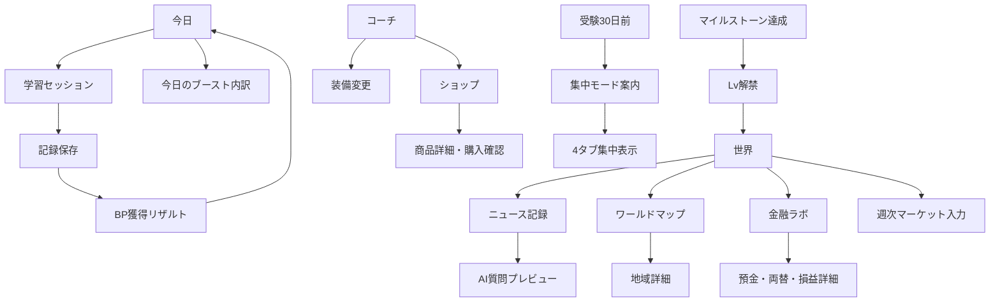

# IBUKI STUDY BEAT 大型アップデート UI/UX設計書

- 対象: iPhone Safari向けPWA（320px〜）
- 現行基準: ver. 3.3.0
- 設計範囲: 画面構成・情報階層・モーダル・演出
- 対象外: 本番の計算ロジック、データ移行、決済連携、キャラクター実画像

> 作成: ChatGPT / 受領: 2026-08-08 / Claudeによるレビュー結果は
> [`../exchange/REVIEW.md`](../exchange/REVIEW.md) を参照

## 0. 設計方針

このアップデートでは、学習記録アプリの上にゲーム・ニュース・金融を重ねるのではなく、次の優先順位で情報を配置する。

1. 今日やること
2. 学習を開始する
3. 学習成果の見える化
4. 継続を助けるBP・装備・コンディション
5. 志望学部につながるニュース・金融体験

初期表示は必ず「今日」。ポイント残高・ショップ・金融残高をヘッダーに常駐させない。新機能はカードとボトムシートで段階的に開く。

### 仕様上の要確認点

- 通常倍率は装備・コンディション合計で最大3.0倍だが、消費アイテム「フィーバータイム」は10倍とされている。本設計では10倍を通常倍率とは別の期間限定状態として表示する。通常倍率との合算・置換・適用順は実装前に確定が必要。
- GTの円換算が為替で変動する仕様はあるが、1GTの基準価値・換算式は未定。本モックの数値は表示例であり計算仕様ではない。
- 「アプリの1週間＝現実の1年」と定期預金の1か月・3か月の期間対応は、利息計算実装前に定義が必要。UIでは換算ルールを常時表示する。

---

## 1. タブ構成の提案

### 採用案: 既存5タブ＋「世界」の6タブ

| 順番 | タブ | 役割 | 設計判断 |
|---:|---|---|---|
| 1 | 今日 | 予定、学習開始、タイマー、今日の積み上げ | 起動時の固定初期画面 |
| 2 | 記録 | 学習記録入力と履歴 | 既存の役割を維持 |
| 3 | グラフ | 計画・実績・累積・受験イベント | 中核仕様を完全維持 |
| 4 | 世界 | ニュース、地図、金融ラボ、週次マーケット | 志望学部に直結する学びを集約 |
| 5 | コーチ | キャラクター、装備、ショップ、仲間 | キャラクター強化の文脈を一か所に集約 |
| 6 | 設定 | プロフィール、科目、AI、データ、集中モード | 管理機能を維持 |

### 理由

- 「世界」はニュース・国際・経済・金融を一つの学習文脈として説明できる。
- ショップを「世界」に入れると金融機能と混同し、ゲームが主役に見える。キャラクターを強化する装備・演出は「コーチ」に置く方が自然。
- 320px幅では1タブ約53pxを確保できる。各タブはアイコン＋2文字程度のラベル、タップ領域は幅44px以上・高さ64pxとする。
- 6タブを超えない。新機能の詳細はタブではなくカードとボトムシートで階層化する。

### 「世界」タブ内の情報順

1. 今日の1ニュース
2. ワールドマップ・仲間
3. 週末まとめ／面接ネタ帳
4. 金融ラボ
5. 週次マーケット

ニュースを先頭にし、銀行・為替・分割払いはLvに応じてカード自体を段階表示する。

---

## 2. 各画面のワイヤーフレーム

### 2.1 今日

```text
┌──────────────────────────┐
│ IBUKI STUDY BEAT        ✎ │
│ [ビートの立ち姿]  今日も一歩、未来へ │
├──────────────────────────┤
│ 今日のスローガン                 │
│ 一日一歩、未来のステージをつくる   │
├──────────────────────────┤
│ 今日の予定                       │
│ □ 英語 過去問  60分              │
│ □ 国語 現代文  45分              │
│ ＋ 予定を追加                    │
├──────────────────────────┤
│   学習を開始する ▶              │ ← 主役
├──────────────────────────┤
│ 今日のブースト  1.35倍   ›        │ ← 1行カード
│ 装備+0.10 / 条件+0.25 / BP 12,450 │
├──────────────────────────┤
│ 今日の積み上げ                   │
│ 90分 / 目標180分  [進捗バー]      │
│ 連続7日・今週420分・受験まで84日   │
└──────────────────────────┘
│ 今日 記録 グラフ 世界 コーチ 設定 │
└──────────────────────────┘
```

ポイントは開始ボタンより下に置く。残高より「今日の倍率」と「なぜその倍率か」を先に見せる。タップで「今日のブースト内訳」モーダルを開く。

### 2.2 記録（既存維持）

```text
┌──────────────────────────┐
│ 記録                              │
├──────────────────────────┤
│ 学習記録フォーム                  │
│ 日付 / 科目 / 内容 / 種別          │
│ 計画分 / 実績分 / 得点             │
│ 振り返り                          │
│              [保存する]           │
├──────────────────────────┤
│ これまでの記録                    │
│ [科目フィルタ] [ごみ箱]            │
│ 8/8 英語 過去問 90分  [編集]       │
└──────────────────────────┘
```

保存成功後だけBP獲得演出を重ねる。フォーム自体にショップや残高を追加しない。

### 2.3 グラフ（仕様変更なし）

```text
┌──────────────────────────┐
│ グラフ                            │
│ [日] [週] [月] [全体]             │
├──────────────────────────┤
│ 白背景グラフパネル                 │
│ 左=計画 / 右=実績 科目別積み上げ棒  │
│ 累積計画=緑 / 累積実績=青           │
│ 未来側 ◆受験イベント               │
│ ←スワイプ / ピンチ / 棒タップ→      │
├──────────────────────────┤
│ 凡例・期間・日別詳細                │
└──────────────────────────┘
```

週次マーケットの折れ線は「世界」に置き、この学習グラフへ混在させない。

### 2.4 世界（新規）

```text
┌──────────────────────────┐
│ 世界                         Lv3 │
│ 学びを未来につなげよう            │
├──────────────────────────┤
│ 今日の1ニュース                  │
│ 0/3本  志望学部一致はBP×1.5       │
│ [ニュースを記録する]              │
├──────────────────────────┤
│ ワールドマップ        12か国点灯 › │
│ [簡略世界地図・国マーカー]         │
│ G7 4/7・アジア 3/8・大陸 2/6      │
├──────────────────────────┤
│ 週末のまとめ             2/3本 ›  │
│ 面接ネタ帳 6件                    │
├──────────────────────────┤
│ 金融ラボ                  Lv3 ›  │
│ BP 24,500 / 円定期 満期まで3日     │
│ 「アプリ1週=現実1年」              │
├──────────────────────────┤
│ 週次マーケット       日曜入力 ›    │
│ ドル円 / 日経 / 円金利 / 米金利     │
└──────────────────────────┘
```

未解放機能は「押せないボタン」ではなく、Lvロードマップ内で条件を示す。カードとして表示するのは解放済み機能だけ。

### 2.5 コーチ（装備・ショップを追加）

```text
┌──────────────────────────┐
│ コーチ                            │
├──────────────────────────┤
│        [スポットライト]            │
│       [キャラ画像領域]              │
│ ビート「今日もリズムよくいこう」    │
│ [ポーズ変更]                       │
├──────────────────────────┤
│ 装備                      合計+0.8 │
│ 衣装 [ハット]  スキル [ムーン…]     │
│ ステージ [ライブハウス]     [変更]  │
├──────────────────────────┤
│ ショップ                        › │
│ 12,450BP / 新着3 / 所持アイテム8    │
├──────────────────────────┤
│ 仲間コレクション        4/50     › │
├──────────────────────────┤
│ メッセージ / AIに聞く              │
└──────────────────────────┘
```

装備は3スロットを常に同じ順序で表示する。各スロットの効果と合計倍率を同時に見せる。

### 2.6 設定（集中モードを追加）

```text
┌──────────────────────────┐
│ 設定                              │
├──────────────────────────┤
│ プロフィール / 目標 / 受験情報      │
│ 科目 / AI / グラフY軸               │
├──────────────────────────┤
│ コンディション記録       [ON]       │
│ 早寝・朝食・運動・休憩・読書         │
├──────────────────────────┤
│ 集中モード                         │
│ 受験30日前に自動ON                  │
│ 対象日 10/12　現在: 84日前          │
│ [集中モードの表示を確認]            │
├──────────────────────────┤
│ データ管理                         │
└──────────────────────────┘
```

集中モードがONになると、世界・コーチを削除せず、下部タブでは非表示にする。既存の学習記録は保持し、今日／記録／グラフ／設定の4タブに戻す。

---

## 3. 新規モーダル一覧

| 名称 | 起点 | 目的 | 主な要素 |
|---|---|---|---|
| 今日のブースト内訳 | 今日のブースト | 今日やる価値を説明 | 基礎1.0、装備、条件、上限、次の加算条件 |
| 学習セッション | 学習開始 | 学習中の集中 | 経過時間、科目、終了・保存 |
| BP獲得リザルト | 記録保存 | 獲得理由を一瞬で理解 | 基本BP、倍率加算、行動ボーナス、合計、キャラ演出 |
| コンディション入力 | 今日／設定 | 任意の生活習慣記録 | 5項目、翌日倍率の予告、保存 |
| 装備変更 | コーチ | 3スロットを比較 | 現在装備、候補、効果、装備する |
| ショップ | コーチ | アイテム購入 | 衣装／スキル／ステージ／消費、残高、所持状態 |
| 商品詳細・購入確認 | ショップ | 誤購入防止 | 効果、価格、購入後残高、購入／戻る |
| 消費アイテム使用 | 所持品 | 時間限定効果の確認 | 効果、期間、週制限、使用開始 |
| 仲間コレクション | コーチ／地図 | 解放状況の確認 | 国・条件・解放済み演出 |
| ニュース記録 | 世界 | 3項目だけ素早く保存 | ジャンル、自分の見出し、理由、国（国際時） |
| AI質問プレビュー | ニュース保存 | 送信内容の確認 | 志望学部別質問文、コピー／AIを開く |
| 週末まとめ | 世界 | 3本選択・200字要約 | ニュース選択、要約、AI添削、ネタ帳保存 |
| 地域詳細 | ワールドマップ | 小画面で国を選ぶ | 地域進捗、国一覧、記録数、仲間条件 |
| 金融ラボ | 世界 | 銀行・為替への入口 | BP、預金、外貨、GT、Lvロードマップ |
| 預金商品詳細 | 金融ラボ | 金利とロックを理解 | 元本、利率、満期、途中解約条件、換算注記 |
| 両替 | 金融ラボ | 手入力レートで換算 | 入力レート、BP、BD、換算結果、確認 |
| 外貨損益詳細 | 金融ラボ | 金利と為替を分解 | 元本、利息、為替差損益、最終結果、説明文 |
| 分割購入比較 | 海外／国内ショップ | 総支払額を比較 | 一括、分割回数、手数料差、信用スコア |
| 信用スコア詳細 | 金融ラボ | 変動理由を理解 | 現在値、履歴、特典、停止条件 |
| GT交換申請 | 金融ラボ | 親承認の申請 | GT、円換算例、月上限、申請、履歴 |
| 週次マーケット入力 | 世界 | 日曜の手入力 | 4指標、理由、保存日、出典メモ欄なし |
| マーケット推移 | 世界 | 入力値の変化を見る | 指標切替、折れ線、前週差、理由 |
| Lv解禁 | マイルストーン達成時 | 新機能の意味を伝える | スポットライト、Lv、新機能、見る／あとで |
| 集中モード案内 | 30日前 | 機能を減らす理由を伝える | 残日数、非表示機能、データ保持、開始 |

すべてボトムシートを基本とし、地図・金融ラボ・ショップなど情報量が多いものは画面高の90%を使うフルハイトシートとする。

---

## 4. 画面遷移図



---

## 5. 設計課題への回答

### Q2. 「今日」画面のポイント・倍率・コンディション

#### 表示位置

「学習を開始する」の直後、「今日の積み上げ」の直前に、1行の「今日のブースト」カードを置く。

#### 表示内容

- 主表示: `今日のブースト 1.35倍`
- 副表示: `装備+0.10・コンディション+0.25`
- 補助: `12,450BP`はカード右下または詳細シート内
- コンディション未入力時: `今夜チェックすると明日の倍率が上がる`とだけ表示

#### やらないこと

- ヘッダーにBP残高を常駐させない。
- 学習開始ボタンより上に倍率を置かない。
- ショップへの直接導線を今日画面に置かない。
- 10倍などの強い訴求を常時点滅させない。

### Q3. 記録保存直後の演出

1. 保存完了の触覚フィードバックを想定した短い金色フラッシュ（視覚設計のみ）。
2. 画面中央に大きく `+282 BP`。
3. 下に3行だけ表示。
   - 学習90分 `+90`
   - 今日の倍率1.35倍 `+32`
   - 行動ボーナス `+160`
4. 行動ボーナスは金色チップで `振り返り +10`、`計画達成 +50`、`連続7日 +100` のように内訳を示す。
5. キャラクターは既存のお祝い画像から条件に合う1枚を表示。
6. 「続ける」で閉じる。「内訳」は同じシート内で展開し、別画面へ飛ばさない。

通常保存は2〜3秒で理解できる密度にする。7日継続・単元クリア・Lv解禁だけ演出を拡張する。

### Q4. 金融の損得

#### 外貨預金結果カード

```text
預けたとき             10,000BP
利息                    +450BP  ███ 緑
為替差損                -692BP  █████ 赤
──────────────────────────
今回の結果              -242BP
10,000BP → 9,758BP
金利では増えましたが、円高による損が上回りました。
```

#### 原則

- 利息と為替差損益を別の色・別の行で表示する。
- 最終残高だけでなく元本からの変化を表示する。
- `得した／損した`を文章で断定し、利用者に計算を委ねない。
- 色だけに依存せず、＋／−と語句を併用する。
- `アプリ1週＝現実1年（52倍速）`を結果カード上部に固定表示する。

### Q5. Lv1〜Lv6の解禁

- 解禁判定は学習記録保存またはニュース保存後に行い、起動直後には割り込ませない。
- 黒背景にスポットライトが点灯し、中央に `Lv4 世界がひらいた`。
- 新機能は1つの短い説明とアイコンで見せる。
- ボタンは `今見る` と `あとで` の2つ。
- 「あとで」を選ぶと世界タブに小さなNEWドットを残す。
- ロードマップでは未解放Lvを押せないボタンにせず、条件を読む情報カードとして表示する。

### Q6. 縦画面のワールドマップ

- 国境を正確に操作する地図ではなく、6大地域の簡略SVGを使う。
- 地図上の国マーカーは進捗の視覚化に使い、細かな選択は地図下の地域チップから行う。
- `地図／国一覧`の切替を用意し、アクセシビリティと検索性を担保する。
- 地域チップは横スクロール、各44px以上。
- 地域を選ぶとフルハイトシートで国一覧、記録数、仲間解放条件を表示する。
- 小さな点そのものをタップ必須にしない。

---

## 6. 集中モード

### 切替タイミング

受験30日前に、次回起動時または記録保存後に一度だけ案内を表示する。

### 表示内容

- `本番まで30日。ステージを受験勉強に絞ります。`
- 非表示になるもの: 世界、コーチ、ショップ、金融、ニュース入力
- 残るもの: 今日、記録、グラフ、設定
- データ・BP・装備・ニュース・金融履歴は消えないことを明記

### タブ

集中モード中は4タブを均等幅で表示する。設定内に状態と対象日を表示し、誤設定時に確認できるようにする。

---

## 7. 「勉強が主役」を保つために意図的にやったこと

### やったこと

- 初期タブを今日に固定。
- 学習開始ボタンをホームの最大の操作要素として維持。
- BP・倍率は開始ボタンの後に配置。
- ニュースを世界タブの先頭、金融を後半に配置。
- ショップはコーチ配下に閉じ込め、今日画面から直接誘導しない。
- 金融機能はLvで段階解放し、一度に見せない。
- 成果演出は短く、保存フローを止めない。
- 受験30日前に娯楽・金融を自動的に隠す。

### やらなかったこと

- BP残高の全画面常駐。
- ショップのセール通知・赤い未読バッジ・カウントダウン。
- ガチャ、ランダム報酬、連続ログインの罰。
- 今日画面へのニュース・銀行・為替カード追加。
- 学習グラフへの金融指標の混在。
- 1画面に全装備・全資産・全Lvを一覧表示。

---

## 8. iPhone実装時のUI基準

- 320px〜430pxを基本範囲とする。
- 本文は15px以上、補助文は12px以上。
- タップ対象は44×44px以上。
- 下部タブは高さ68px＋safe-area-inset-bottom。
- モーダルはボトムシート。閉じる操作は右上44px、背景タップでも閉じられる設計を基本とする。
- 横スクロールは地域チップなど限定的に使い、主要カードは縦一列。
- `prefers-reduced-motion`では紙吹雪・カウントアップ・スポットライト移動を停止する。
- 成否や損益は色だけに依存せず、符号・ラベル・文章を併用する。

## 9. モックアップで確認できる範囲

同梱HTMLモックでは以下を切り替えて確認できる。

- 6タブ構成
- 今日のブースト
- 学習開始→BP獲得リザルト
- 世界ホーム
- ニュース入力
- ワールドマップ
- 金融ラボと外貨損益分解
- 週次マーケット入力
- コーチの3装備スロットとショップ
- Lv解禁演出
- 集中モード案内

モック内のJavaScriptは画面とモーダルを切り替えるためだけのデモ用であり、本番計算・保存・外部通信は行わない。
