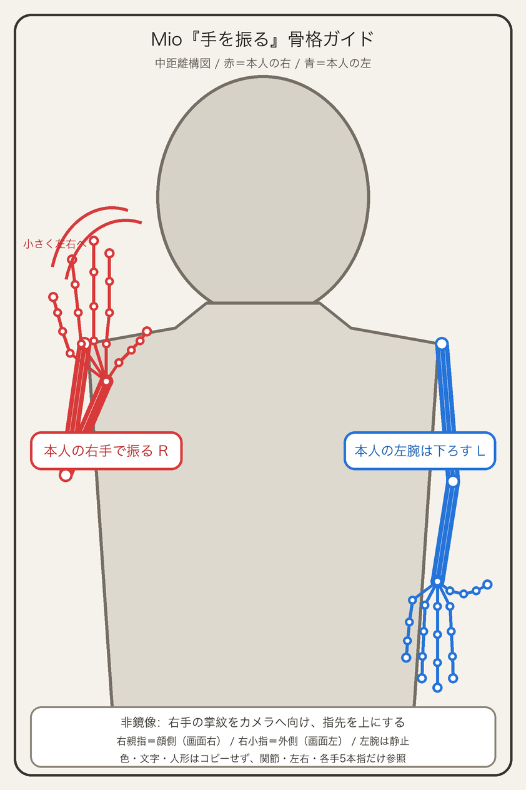
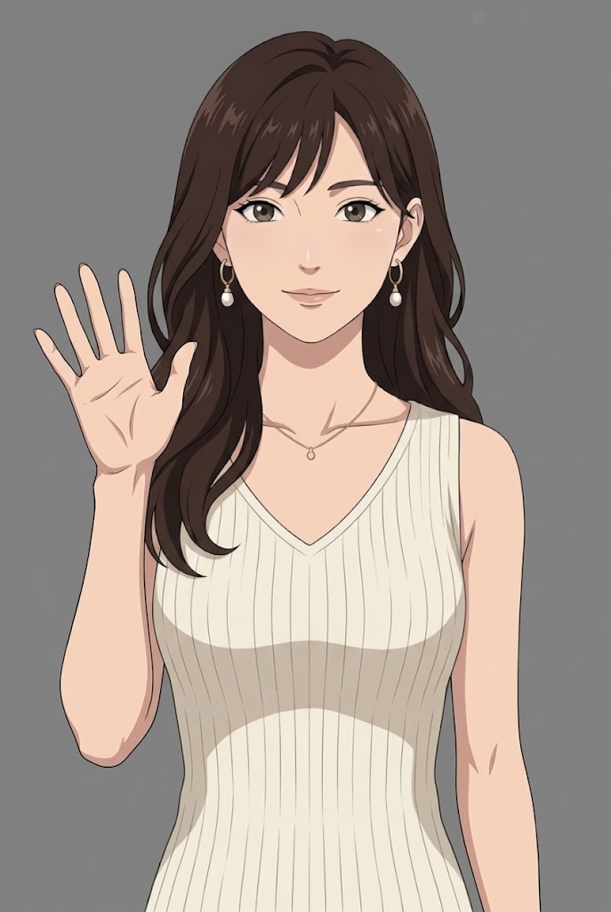
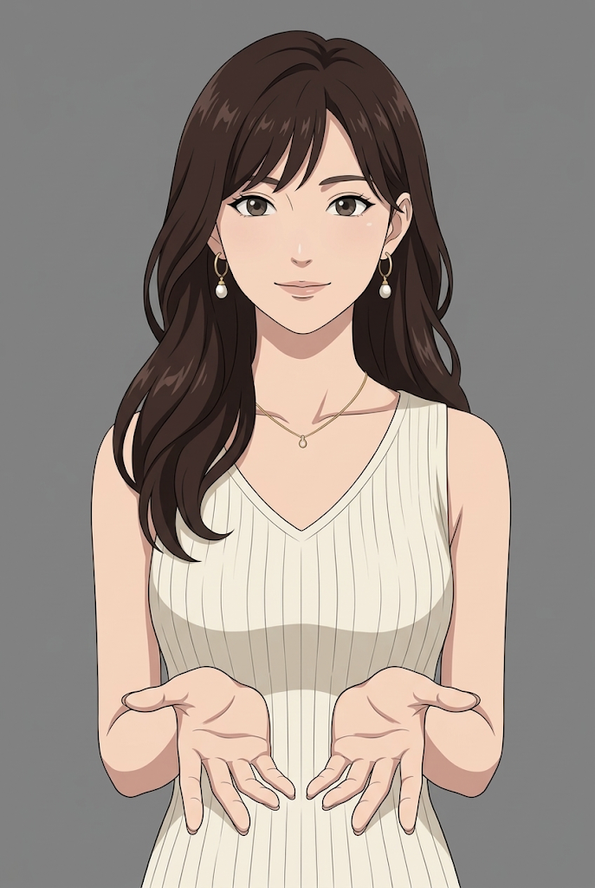

# Mio wave pose review packet

Claude が認証なしで画像と座標を確認するための公開レビュー用複製です。
アプリ本体・API キー・設定値は含みません。

## 正本

- private repository: `arumat-ken/mio-companion`
- branch: `codex/mio-hand-gestures`
- original reviewed source commit: `1b45c7b32346f300d6b7d811adefbe89510a6d7f`
- review-record source commit: `530cb1c`
- copied at: 2026-10-04 JST

この公開コピーはレビュー専用です。実装と正本管理は `mio-companion` で行います。

## 画像

### 訂正後の骨格ガイド

### Gemini 生成画像（第1候補・合格へ訂正）

### 同一人物・中距離構図の基準画像

## 固定条件

- 非鏡像で、人物はカメラに正対する。
- 本人の右腕は画面左、本人の左腕は画面右。
- 本人右手は指先を上へ向け、掌紋をカメラへ向ける。
- この姿勢では、本人右手の親指は顔側（画面右）、小指は外側（画面左）。
- 生成画像は変更していない。以前逆だった骨格ガイドと QA 判定だけを訂正した。

## レビュー対象

- `pose-guide.png`: 訂正後の骨格ガイド
- `generated-upper-candidate-1.png`: Gemini 生成画像
- `identity-reference-medium.png`: 左右非対称の髪などを確認する基準画像
- `pose.json`: 本人基準の左右と21点座標
- `qa-candidate-1.json`: 訂正履歴を含む合否記録
- `manifest.json`: 出所、hash、状態
- `render_guide.py`: `pose-guide.png` の再生成スクリプト
- `CLAUDE_REVIEW.md`: Claude Codeの合格判定と、切り出し前に直すべき記録
- `right-arm.png`: 生成画像の実座標から切り出した本人右腕の透過PNG
- `right-arm-preview.png`: 市松背景での透過確認
- `right-arm-mask-overlay.png`: 元画像上の抽出範囲
- `extract_right_arm.py`: 687×1024の実画像から再現するローカルスクリプト

生成モデル名は検証可能な記録がないため、推測せず `未記録` のままです。

## 腕パーツの制限

切り出したのは元画像で実際に見えている本人右手、手首、前腕、肘の画素です。
肩関節と上腕の一部は髪・手首・前腕に隠れているため補完していません。
ポーズ固有の重ね合わせには使えますが、肩から自由に回転させる骨格リグの完成素材ではありません。

## Claudeへの依頼

画像を実際に開き、上の固定条件に対して次を回答してください。

1. `pose-guide.png` の画面左の赤い手は、本人右手として正しいか。
2. `generated-upper-candidate-1.png` の画面左の手は、本人右手として正しいか。
3. 基準画像と比較して、生成画像が左右反転した証拠はあるか。
4. 結論を「骨格ガイド: 合格/不合格」「生成画像: 合格/不合格」で示す。

画像再生成、ファイル編集、GitHub更新は行わず、レビュー結果だけを返してください。
